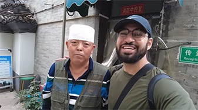

# Beijing’s Niu Street: Mosques and Halal Food

Niu Jie is a historic area rich in cultural heritage, especially known for its strong Hui ethnic culture and Islamic traditions. At the heart of Niu Jie is the Niu Jie Mosque, which was originally established in 966 AD during the Liao Dynasty and is one of the oldest mosques in Northern China and the largest in Beijing. The mosque serves not only as a center for religious activities but also as a hub for community cultural and social events.

<YouTube link="https://youtu.be/KvbhHsrZW6A?si=YIhhv5xgUqSSVLmv">
<template #cover></template>
<template #title>They Told Me Islam Was Banned In China? (Muslim Street in Beijing)</template>
<template #author>Waleed Maoed</template>
<template #description>Before coming to China people would always say I won't have a great experience visiting China as a Muslim, and they would also say that Islam was banned in China. So I had to go and see how life is really like in the capital city Beijing.</template>
</YouTube>

The Niu Jie area is home to a large Hui population and features numerous restaurants and shops selling halal foods, earning it the reputation as "Beijing's Halal Food Paradise." Visitors can sample a variety of authentic halal dishes such as lamb skewers, lamb spine hot pot, and beef pies. Besides the culinary delights, Niu Jie is also known for its traditional handicrafts and unique festival celebrations.
