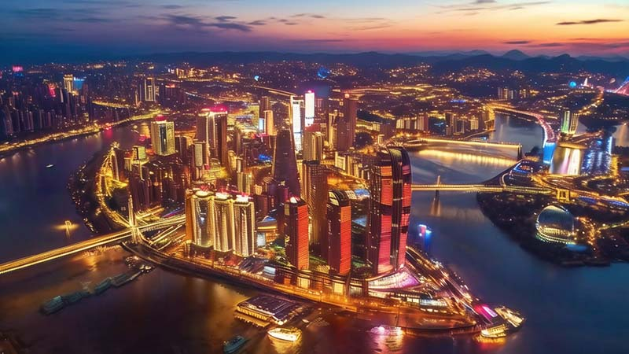
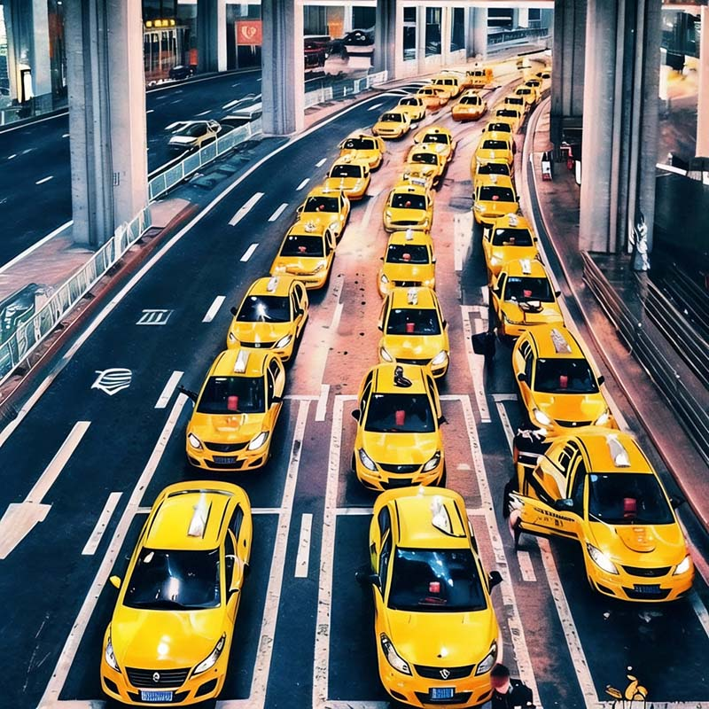

## Flight

The primary way to arrive in Chongqing is by air, with flights landing at the Jiangbei International Airport.

Chongqing Jiangbei International Airport is a large-scale, Grade 4F civil airport, approximately 19 kilometers away from the city center. The airport has accumulated a total of hundreds international routes, indicating a substantial network of international flights. This includes destinations across Asia, Europe, America, and beyond. For instance, direct flights include: Phnom Penh, Paris, Budapest, Milan, Rome, Osaka, Vientiane, Kuala Lumpur, Penang, Kathmandu, Doha, Moscow, Seoul, Madrid, Colombo, Bangkok, Phuket, Koh Samui, Dubai, London, Ho Chi Minh City, Hanoi.

## Night View from Above

Chongqing's night views are incredibly famous. Should you happen to arrive in Chongqing at night, opting for a window seat on **the left side** of the aircraft gives you <u>a 50% chance (determined by wind direction) to witness the beautiful urban night scenery of Chongqing</u> just before the plane lands.

> The runway numbers at Chongqing Jiangbei International Airport are 02/20. Runway 02 is used for landings and takeoffs on a heading of north-east. The approach path for this runway happens to pass over the most beautifully lit urban area of Chongqing, presenting a stunning night view. Whether Runway 02 or Runway 20 is used for actual landings depends on the wind direction. Planes typically land into the wind, so when there is a southwest wind, there's a high probability that planes will be landing on Runway 02.

If you're fortunate enough, as the plane clears the final mountain and makes its last right-hand maneuver, you'll catch sight of the Chongqing urban area, with only a few minutes remaining until touchdown.

## Yellow Taxis

<Flex>

You won't need any guide to find them; bright yellow taxis will surely greet you upon exiting the airport, ready to take you into the city.

The taxi fare from Chongqing Jiangbei International Airport to Downtown is approximately 70 RMB (around 9 Euros).

Alternatively, you can reach the city center by taking the metro.

For more information, see [Chongqing Traffic](/chongqing/traffic)

</Flex>
