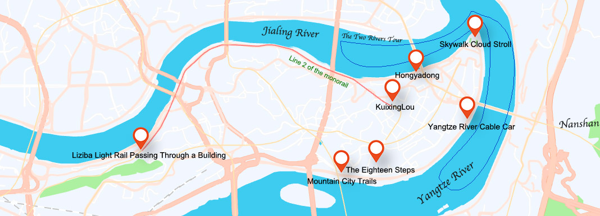
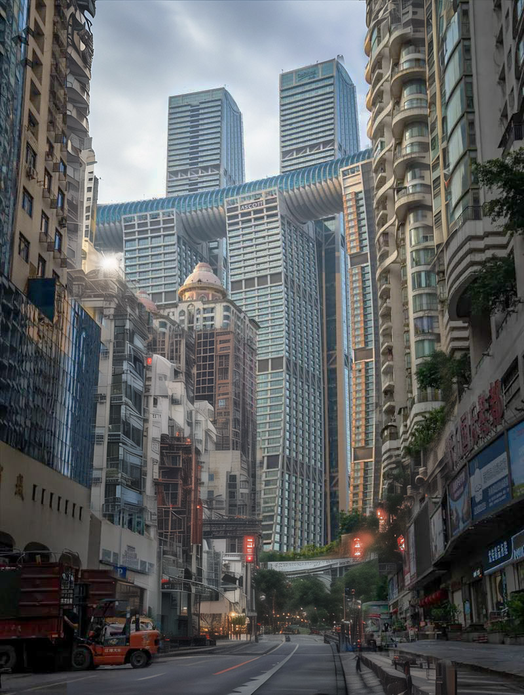
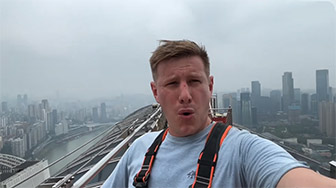
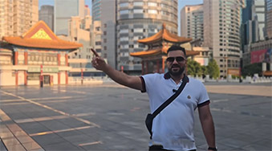
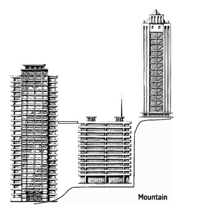
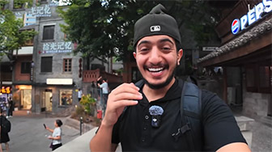

# One Day Urban Tour: Explore Chongqing's Cyberpunk

## Chongqing Raffles

Chongqing Raffles is a new landmark building that integrates offices, a hotel, apartments, a shopping mall, and an observation deck. You can stay at the InterContinental Hotel in Chongqing Raffles, or choose an Airbnb within the building.

<Flex>

Chongqing Raffles is a new landmark building that integrates offices, a hotel, apartments, a shopping mall, and an observation deck. You can walk on the top of its Crystal Sky Bridge, which is 250 meters high, and experience a 360-degree view of Chongqing.

This building is located at Chaotianmen, where the Yangtze River meets the Jialing River. Due to the different sediment contents in the two rivers, you can observe the unique spectacle of the two colors of river water. This place was an important dock in ancient Chongqing. It was also the main gate used for welcoming officials and receiving imperial edicts in ancient times, hence the name "Facing Heaven Gate".

</Flex>

#### Skywalk Cloud Stroll

 
<Description>

<i>Best Time to Visit</i><b>Daytime</b>

<i>Duration of Stay</i><b>1 Hour</b>

<i>Activities</i><b>Sightseeing, Thrilling</b>

<i>Crowd Level</i><b>Quiet</b>

<i>Ticket Price</i><b><CNY>198</CNY></b>

<i>Recommendation</i><b>Recommended</b>

<i>Navigation</i><b><Navigation position="106.58737,29.564933" name="Skywalk Cloud Stroll" /></b>

</Description>

The observation deck on the top floor of Raffles can serve as your starting point for sightseeing. You can walk on the top of its Crystal Sky Bridge, which is 250 meters high, and experience a 360-degree view of Chongqing.

<YouTube link="https://youtu.be/oRiCTslilJo?si=7sQ-qtAe11a8YKqo">
<template #cover></template>
<template #title>Chongqing: The City That Defies Expectations</template>
<template #author>Wilko Wanders</template>
<template #description>China’s Mega City Chongqing Blew my mind 🤯 and not just because of the spicy hotpots! 🌶️</template>
</YouTube>

## KuixingLou

<Chinese word="魁星楼">
<template #pinyin>kuí xīng lóu</template>
KuixingLou
</Chinese>

<Description>

<i>Best Time to Visit</i><b>Daytime</b>

<i>Duration of Stay</i><b>Minutes</b>

<i>Activities</i><b>Check-in</b>

<i>Crowd Level</i><b>Quiet</b>

<i>Ticket Price</i><b>Free</b>

<i>Recommendation</i><b>Optional</b>

<i>Navigation</i><b><Navigation position="106.573596,29.560241" name="KuixingLou" /></b>

</Description>

<YouTube link="https://youtu.be/ui-I6Jg7Qsc?si=TJKyX1QGnK_SRfX7&t=959">
<template #cover></template>
<template #title>Chongqing Is On Another Level</template>
<template #author>Skan Escapes</template>
<template #description>A city built upon landscapes of hills , rivers, and valleys.
It's truly incredible ! A city is a mega city and quickly becoming a huge tourist attraction to many!</template>
</YouTube>

You may have already seen it online, that place where you think you're on the 1st floor but you're actually on the 22nd. You might not be able to imagine why this is so, or perhaps, as mentioned in "The Prestige," you don't really want to know the truth; you just want to be fooled.

::: info LOCAL TIPS
You can walk to Kuixinglou for a visit, and then take Line 2 of the monorail from the nearby Linjiangmen Station to reach Liziba Station.
:::

## Liziba Light Rail Passing Through a Building

<Chinese word="李子坝">
<template #pinyin>lǐ zǐ bà</template>
Liziba
</Chinese>

<Description>

<i>Best Time to Visit</i><b>Daytime</b>

<i>Duration of Stay</i><b>Minutes</b>

<i>Activities</i><b>Check-in</b>

<i>Crowd Level</i><b>Crowd</b>

<i>Ticket Price</i><b>Free</b>

<i>Recommendation</i><b>Recommended</b>

<i>Navigation</i><b><Navigation position="106.537323,29.552874" name="Liziba Station" /></b>

</Description>

The Liziba Light Rail passing through a building is a unique urban feature in Chongqing, where a light rail line actually runs through a high-rise residential building. For the locals, this is the route they take as part of their daily commute between the cities for work and life. The Line 2 was built in 2005, so this "sight" is already quite ordinary for the locals.

It's worth noting that this line travels between the river and the mountains, and the scenery along the way should not be missed.

<YouTube link="https://youtu.be/qAwbioLzTkk?si=tLuCzXjMDcMGuJd7&t=439">
<template #cover></template>
<template #title>33 млн жителей. Огромный китайский мегаполис и самое красивое метро</template>
<template #author>Касё Гасанов</template>
<template #description>Taking the Chongqing Light Rail, I arrived at the most famous online celebrity check-in spot.</template>
</YouTube>

Following the mountain path behind the light rail station will lead you to a new attraction built on the site of the former Chongqing Mint. Climbing to the top of the mountain also offers some nice views. However, make sure not to get lost.

<YouTube link="https://youtu.be/sr_3l726CV4?si=PRiwUD4rgxUXVQeU&t=335">
<template #cover></template>
<template #title>GETTING LOST IN CHONGQING! CHINA VLOG</template>
<template #author>Ride with Gabi</template>
<template #description>After walking ten minutes from the Liziba monorail through the building, I was completely lost in Chongqing, following endless steps into a mysterious place.</template>
</YouTube>

## Mountain City Trails

<Chinese word="山城步道">
<template #pinyin>shān chéng bù dào</template>
Mountain City Trails
</Chinese>

<Description>

<i>Best Time to Visit</i><b>Daytime</b>

<i>Activities</i><b>Strolling</b>

<i>Crowd Level</i><b>Quiet</b>

<i>Ticket Price</i><b>Free</b>

<i>Recommendation</i><b>Optional</b>

<i>Navigation</i><b><Navigation position="106.566715,29.550486" name="Mountain City Trails" /></b>

</Description>

In old Chongqing, the Mountain City Walkway was a common route for people to travel. Built on the cliffs beside the Yangtze River, the path here is narrow, and the houses still retain an old-world charm. From here, you can overlook the Yangtze River. If you're not in a rush and enjoy a place where you can walk quietly, you'll love it here. When I was a child, I preferred walking through these mountain paths because you never know what you'll find at the end of the road. I always remember the joy of discovering a new shortcut.

::: info LOCAL TIPS
Chongqing has many hidden pedestrian paths that you can choose from based on your itinerary; however, please pay attention to safety and don't get lost.
:::

## The Eighteen Steps

<Chinese word="十八梯">
<template #pinyin>shí bā tī</template>
The Eighteen Steps
</Chinese>

<Description>

<i>Best Time to Visit</i><b>Anytime</b>

<i>Activities</i><b>Sightseeing</b>

<i>Crowd Level</i><b>Crowd</b>

<i>Ticket Price</i><b>Free</b>

<i>Recommendation</i><b>Recommended</b>

<i>Navigation</i><b><Navigation position="106.573046,29.551019" name="The Eighteen Steps" /></b>

</Description>

Since the entire city is built on a hilly terrain, the old houses were constructed following the natural contours of the mountains, with countless staircases winding their way through them. The Eighteen Steps area completed its relocation in 2015, and all the original residents moved out. However, the area has managed to retain the atmosphere of old Chongqing. If you are interested in the culture of old Chongqing, you can come here to experience it.

<YouTube link="https://youtu.be/sWm6Jk-dzCs?si=Y4K0GAIuhlTMVD0y&t=475">
<template #cover>هذا هو سبب تفوق الصين على الغرب " /></template>
<template #title>هذا هو سبب تفوق الصين على الغرب ! - Chongqing</template>
<template #author>Ahmed Alshammari</template>
<template #description></template>
</YouTube>

## Yangtze River Cable Car

<Chinese word="长江索道">
<template #pinyin>cháng jiāng suǒ dào</template>
Yangtze River Cable Car
</Chinese>

<Description>

<i>Best Time to Visit</i><b>Daytime, Nighttime</b>

<i>Activities</i><b>Sightseeing</b>

<i>Crowd Level</i><b>Very Crowd</b>

<i>Ticket Price</i><b><CNY>20</CNY> to <CNY>30</CNY></b>

<i>Recommendation</i><b>Recommended</b>

<i>Navigation</i><b><Navigation position="106.586316,29.556428" name="Yangtze River Cable Car" /></b>

</Description>

Chongqing once had two cross-river cable cars, but the one over the Jialing River has been dismantled, leaving only the one over the Yangtze River. Originally serving as a means of transportation for the locals in Chongqing, the cable car was a necessity when there were few bridges and limited transportation options, making it essential for residents to use ferries or the cable car to travel between the riverbanks. Today, Chongqing has become known as the "City of Bridges," and the unique cable car has transformed into a tourist attraction. It's recommended to purchase a round-trip ticket.

## Nanshan

<Chinese word="南山">
<template #pinyin>nán shān</template>
Nanshan
</Chinese>

<Description>

<i>Best Time to Visit</i><b>Daytime, Nighttime</b>

<i>Activities</i><b>Sightseeing, Hiking</b>

<i>Crowd Level</i><b>Quiet</b>

<i>Ticket Price</i><b>Free</b>

<i>Recommendation</i><b>Recommended</b>

</Description>

Nanshan, located east of the Yangtze River, is a large mountain and also an excellent spot to view the night scenes of Chongqing, with several viewing points to choose from. Besides driving up the mountain, locals also opt to hike, using both commonly frequented trails and hidden paths.

::: info LOCAL TIPS
If you choose to hike up the mountain to watch the sunset, please bring a flashlight as there may not be street lamps along the trail, and be sure to pay attention to your safety.
:::

<YouTube link="https://youtu.be/ek8eN4VxbjA?si=aB3YnHZYmWuVE7RT&t=960">
<template #cover></template>
<template #title>Chongqing - CHINA'S MEGA CITY - YOU haven't heard of!</template>
<template #author>Joel Friend</template>
<template #description>Away from the hustle and bustle of 32 million people, We found a hidden trail leading to a sky forest bar where We could watch the city sunset; We found the magic spot.</template>
</YouTube>

Nanshan was formerly known as Tushan, which figures in the ancient Chinese legend of "Yu Marrying Tushan." According to the legend, Yu the Great, who controlled the floods, met his wife Tushan here. Shortly after their marriage, Yu bid farewell to his wife to manage the floods, leaving her for several years. Tushan is said to have waited by the Yangtze River for her husband’s return, missing him deeply and weeping continuously. Tushan Temple still stands on the mountain, recognized as the oldest temple in Chongqing, originally built during the Western Han Dynasty, and features the "Yu Wang Flood Control Stele." Tushan Temple gained widespread recognition due to a poem written by the great Tang Dynasty poet Bai Juyi, titled "Tushan’s Solitary Visit." The poem reads: "Walking alone on the wild path, with a scheduled stay at the monk’s quarters; Coming and going from Tushan, only the hooves of the horse know the way." This shows that Tushan was already famous more than 1,000 years ago.

On Nanshan, there is also [Laojundong](/chongqing/culture#laojundong), which was originally established during the Three Kingdoms period and is considered a sacred place in Daoism. From there, one can overlook the Yangtze River as it flows eastward, presenting a grand sight. Behind the cave, Tushan's grotto is peaceful and beautiful, with the four characters "Tushan Cave Touching the Sky" engraved on the cave's ceiling in strong, bold strokes.

## Hongyadong

<Chinese word="洪崖洞">
<template #pinyin>hóng yá dòng</template>
Hongyadong
</Chinese>

<Description>

<i>Best Time to Visit</i><b>7:00 PM to 10:00 PM</b>

<i>Activities</i><b>Check-in</b>

<i>Crowd Level</i><b>Very Crowd</b>

<i>Ticket Price</i><b>Free</b>

<i>Recommendation</i><b>Recommended</b>

<i>Navigation</i><b><Navigation position="106.577827,29.562356" name="Hongyadong" /></b>

</Description>

This place was a famous scenic spot during the Song Dynasty, over 700 years ago, known as "Hongya Verdant Droplets". The structures here were severely damaged during World War II and were later rebuilt in 2006 as a commercial district.

It has become a popular internet sensation primarily due to its distinctive architecture and lighting effects. This is also closely related to the night scene lighting of Chongqing, as Hongyadong is situated in one of the best locations for the city's skyline. It is precisely because of this that it has attracted a large number of visitors.

Near Hongyadong, there is the Qiansimen Bridge; walking across it will take you to the Chongqing Grand Theatre. Here, whether during the day or at night, you can see Chongqing's spectacular city skyline, and there are relatively fewer people.

::: info LOCAL TIPS
You can take the Monorail Line 1 from Xiaoshizi Station and get off at the Grand Theatre Station. There, you'll not only be able to photograph Hongya Cave but also capture the beautiful night views of Chongqing's cityscape. Before that, you can walk back to the Hongya Cave side via the Qiansimen Bridge.
:::

## The Two Rivers Tour

<Chinese word="两江游">
<template #pinyin>liǎng jiāng yóu</template>
The Two Rivers Tour
</Chinese>

<Description>

<i>Best Time to Visit</i><b>Nighttime</b>

<i>Activities</i><b>Sightseeing</b>

<i>Crowd Level</i><b>Quiet</b>

<i>Ticket Price</i><b><CNY>98</CNY> to <CNY>258</CNY></b>

<i>Recommendation</i><b>Recommended</b>

<i>Location</i><b>Chao Tian Men Wharf (near Raffles City)</b>

</Description>

The Two Rivers Tour usually passes by some famous landmarks, such as Chaotianmen, Hongyadong, and Nanbin Road. The night tour of the two rivers is particularly charming because when night falls, the lights on both banks shine brilliantly, presenting another kind of beauty to the entire city.

The sightseeing cruise departs from Chao Tian Men Wharf, proceeds to the Huanghuayuan Bridge, makes a turn at the confluence of the two rivers, then heads to near the Sheraton Hotel before returning to Chao Tian Men Wharf. The voyage is approximately 20 kilometers, and the tour duration is about 60 minutes.

<YouTube link="https://youtu.be/hCgd58A-tFU?si=j-uNzN0_0qhQfxFK&t=997">
<template #cover></template>
<template #title>INSIDE CHINA’S MONSTER CITY - Chongqing</template>
<template #author>JetLag Warriors</template>
<template #description>This city is built on a mountain, there are many peculiar buildings. Warning: it's very easy to get lost here! So we boarded a night cruise to see Chongqing's night lights; It's truly stunning.</template>
</YouTube>

<YouTube link="https://youtu.be/0Yt5R3_af6A?si=oGzkYr6pzUmFaPYk&t=627">
<template #cover></template>
<template #title>China at NIGHT...</template>
<template #author>Jack Torr & Sophia</template>
<template #description></template>
</YouTube>
