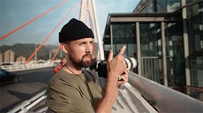

## Cable Car

<Youtube href="https://youtu.be/HUAud37TlCk?si=OXMv8ObJYPlnFvzX&t=181" title="CHONGQING - 1 day photographing Chinas mega city - A Journey Though China Ep. 5 - Scott Howes">

</Youtube>

## Sunset View

<Youtube href="https://youtu.be/ek8eN4VxbjA?si=aB3YnHZYmWuVE7RT&t=960" title="Chongqing - CHINA'S MEGA CITY - YOU haven't heard of! 🇨🇳 - Joel Friend">

</Youtube>

## Night View

## Yangtze River Cruise

<Speech>长江游轮</Speech>(Yangtze River cruise) in Chongqing that includes a night tour is a particularly scenic and memorable experience.

<Youtube href="https://youtu.be/hCgd58A-tFU?si=j-uNzN0_0qhQfxFK&t=997" title="INSIDE CHINA’S MONSTER CITY: Chongqing 🇨🇳 - JetLag Warriors">

</Youtube>
