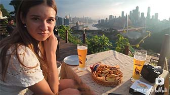

# Chongqing's 8D Metropolis & Cyberpunk

## Hongyadong

<Chinese word="洪崖洞">
<template #pinyin>hóng yá dòng</template>
Hongyadong
</Chinese>

Hongya Cave, also known as Hongyadong, is a famous landmark and tourist attraction in Chongqing. It is a multi-level complex featuring traditional Sichuan-style architecture. The buildings are built into the side of a cliff, overlooking the Jialing River, and are illuminated at night, creating a spectacular sight.

Hongyadong is particularly known for its distinctive architectural style and its lively atmosphere, especially during the evening when the lights come on. It has become a popular spot for tourists and locals alike to experience the unique culture and nightlife of Chongqing.

Hongyadong Lighting Schedule:
- Lighting Time: 8:00 PM to 10:00 PM
- Best Viewing Time: After 7:00 PM in winter, after 8:00 PM in summer

## Liziba Light Rail Passing Through a Building 

<Chinese word="李子坝">
<template #pinyin>lǐ zǐ bà</template>
Liziba
</Chinese>

The Liziba Light Rail passing through a building is a unique urban feature in Chongqing, where a light rail line actually runs through a high-rise residential building. This phenomenon has become a popular tourist attraction due to its novelty and the impressive engineering involved.

## Mountain City Trails

<Chinese word="山城步道">
<template #pinyin>shān chéng bù dào</template>
Mountain City Trails
</Chinese>

Mountain City Trails typically refer to pedestrian paths built in mountainous cities to facilitate travel for pedestrians. In China, Chongqing is a famous mountain city with many characteristic mountain city trails. These trails are not only a choice for daily commuting for locals but also popular attractions for tourists to experience the unique terrain and culture of Chongqing.

<YouTube link="https://youtu.be/sr_3l726CV4?si=P5sIfQ89FDjY7jl5&t=407">
<template #cover></template>
<template #title>GETTING LOST IN CHONGQING! CHINA VLOG</template>
<template #author>Ride with Gabi</template>
<template #description>After walking ten minutes from the Lizi Dam monorail through the building, I was completely lost in Chongqing, following endless steps into a mysterious place.</template>
</YouTube>

## Yangtze River Cable Car

<Chinese word="长江索道">
<template #pinyin>cháng jiāng suǒ dào</template>
Yangtze River Cable Car
</Chinese>

The Yangtze River Cable Car is a cable car system that crosses the Yangtze River in Chongqing, China. It was originally designed and used as a means of public transportation in Chongqing, China. Over time, it has become a popular tourist attraction while still serving as a form of transit for locals.

## Sunset View

Nanshan, also known as South Mountain, is a scenic area in the Nan'an District of Chongqing. It offers some of the best views of the city and is particularly known for its breathtaking night scenes. From the top of Nanshan, you can enjoy panoramic views of Chongqing, including its impressive skyline, the convergence of the Yangtze and Jialing rivers, and the city's many bridges and lights.

<YouTube link="https://youtu.be/ek8eN4VxbjA?si=aB3YnHZYmWuVE7RT&t=960">
<template #cover></template>
<template #title>Chongqing - CHINA'S MEGA CITY - YOU haven't heard of!</template>
<template #author>Joel Friend</template>
<template #description>Away from the hustle and bustle of 32 million people, We found a hidden trail leading to a sky forest bar where We could watch the city sunset; We found the magic spot.</template>
</YouTube>

## Night View

The light show typically starts in the early evening and continues until around 10:00 PM. The exact start time may vary based on the season, with later start times in the summer due to later sunsets and earlier start times in the winter.

## Yangtze River Cruise

<Chinese word="长江游轮">
<template #pinyin>cháng jiāng yóu lún</template>
Yangtze River cruise
</Chinese>

Yangtze River cruise in Chongqing that includes a night tour is a particularly scenic and memorable experience.

<YouTube link="https://youtu.be/hCgd58A-tFU?si=j-uNzN0_0qhQfxFK&t=997">
<template #cover></template>
<template #title>INSIDE CHINA’S MONSTER CITY - Chongqing</template>
<template #author>JetLag Warriors</template>
<template #description>This city is built on a mountain, there are many peculiar buildings. Warning: it's very easy to get lost here! So we boarded a night cruise to see Chongqing's night lights; It's truly stunning.</template>
</YouTube>
