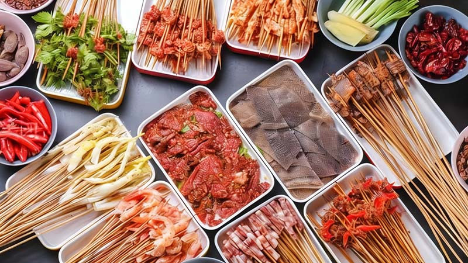

# Chongqing Hot Pot Delights: Your Guide to Local Favourites and Must-Try Dishes

## Introduction

Chongqing hotpot originated on the Yangtze River banks in the early 20th century. Dock workers cooked cheaper offal and scraps in a broth of chili and Sichuan pepper. Over time, this developed into the distinctive Chongqing hotpot.

The estimated number of hotpot restaurants in Chongqing is around 30,000. Chongqing residents' love for hotpot knows no season; even in the scorching summer, the allure of hotpot remains undiminished.

In addition, it has become a manifestation of social activities. Whether it's family gatherings, dinners with friends, or business banquets, hotpot is always among the top choices.

## Must-Know

### Diversity

The diversity of Chongqing hotpot is reflected in its numerous variations, categorized into "old-school hotpot," "skewered hotpot," and other types of hotpot.

- <Speech>老火锅</Speech>(Old-School Hot Pot): The traditional Chongqing hotpot, characterized by a base of beef tallow, Sichuan peppercorns, dried chili peppers, and other spices.
- <Speech>串串火锅</Speech>(Skewered Hot Pot): It offers a more convenient dining format, where ingredients are threaded onto bamboo skewers.

### Duration

A hotpot meal usually lasts 1-4 hours, due primarily to various contributing factors.

- It is a social dining style where people cook and eat together at a shared table.
- In the cooking process, ingredients are individually prepared in broth, requiring time to achieve optimal texture and flavor, with some needing precise cooking durations.
- The diverse hotpot ingredient range requires time for selection, prep, and tasting.

### Broth Choice

When you step into a hotpot restaurant, the very first thing you'll be asked is what kind of broth you'd like your hotpot to be – it’s the crucial starting point for any hotpot dining experience.

<table>
  <thead>
    <tr>
      <th>Level</th>
      <th>Spiciness</th>
      <th>Suitability</th>
    </tr>
  </thead>
  <tbody>
    <tr>
      <td><Speech>清汤</Speech>(Clear Broth)</td>
      <td>Non-spicy 🥬</td>
      <td>Disregarded</td>
    </tr>
    <tr>
      <td><Speech>鸳鸯锅</Speech>(Double-Flavor Pot)</td>
      <td>Divided Clear & Spicy Broth</td>
      <td>Recommended for First Try</td>
    </tr>
    <tr>
      <td><Speech>红汤</Speech>(Spicy Broth)</td>
      <td>Spicy 🌶️</td>
      <td>Recommended, Locals Favorite</td>
    </tr>
  </tbody>
</table>

### Spiciness Choice

If you choose spicy broth, you'll be asked is how spicy you'd prefer.

<table>
  <thead>
    <tr>
      <th>Level</th>
      <th>Spiciness</th>
      <th>Suitability</th>
    </tr>
  </thead>
  <tbody>
    <tr>
      <td><Speech>微微辣</Speech>(Slight Spicy)</td>
      <td>🌶️🌶️</td>
      <td>Recommended, Locals Favorite</td>
    </tr>
    <tr>
      <td><Speech>微辣</Speech>(Mild Spicy)</td>
      <td>🌶️🌶️🌶️</td>
      <td>Recommended, Locals Favorite</td>
    </tr>
    <tr>
      <td><Speech>中辣</Speech>(Medium Spicy)</td>
      <td>🌶️🌶️🌶️🌶️</td>
      <td>Locals Only</td>
    </tr>
    <tr>
      <td><Speech>特辣</Speech>(Extra Spicy)</td>
      <td>🌶️🌶️🌶️🌶️🌶️</td>
      <td>Locals Only</td>
    </tr>
  </tbody>
</table>

### Dipping Sauce

The oil dip is typically self-service. However, you can always ask a server if needed.

<table>
  <thead>
    <tr>
      <th>Sauce</th>
      <th>Spiciness1</th>
      <th>Suitability</th>
    </tr>
  </thead>
  <tbody>
    <tr>
      <td><Speech>香油蒜泥油碟</Speech>(Garlic Chili Oil Dip)</td>
      <td>Mitigating Spiciness</td>
      <td>Strongly Recommended</td>
    </tr>
    <tr>
      <td><Speech>菜油油碟</Speech>(Vegetable Oil Dip)</td>
      <td>Spicy 🌶️🌶️</td>
      <td>Locals Only</td>
    </tr>
    <tr>
      <td><Speech as="甘油碟">干油碟</Speech>(Dry Oil Dip)</td>
      <td>Spicy 🌶️🌶️🌶️🌶️🌶️</td>
      <td>Locals Only</td>
    </tr>
  </tbody>
</table>

<dl style="font-size:12px;">
<dd style="margin:0;">Spiciness1: The influence of the oil dip on the spiciness of the red broth.</dd>
</dl>

<Flex>

</Flex>

#### Garlic Chili Oil Dip

The classic dipping sauce in Chongqing hotpot culture, which includes **sesame oil** and **garlic**, can be referred to as "<Speech>香油蒜泥油碟</Speech>(Garlic Chili Oil Dip)". It plays several key roles, notably in:

- **Cooling Down**: It helps to reduce the surface temperature of the hotpot ingredients.
- **Mitigating Spiciness**: It can temper the spiciness of the food, allowing even those sensitive to heat to better enjoy their hotpot experience.
- **Enhancing Flavor**: It adds an extra layer of flavor to the hotpot ingredients.
- **Protect Gastrointestinal**: It helps reduce negative effects linked to eating spicy foods.

::: info Local Tips
As the hotpot gets spicier with each serving, you can add '<Speech>陈醋</Speech>(aged vinegar)' to your oil dip at opportune moments to further ease the spiciness.
:::

#### Vegetable Oil Dip

The hidden specialty oil dip, typically not readily available and only obtainable by asking a server. Similar to the garlic sesame oil dip, but made with vegetable oil instead. It has a distinctive flavor. Unlike some dips, it does not mitigate spiciness and can be extremely hot when consumed.

#### Dry Chili Dip

The dry version, known as "<Speech as="甘油碟">干油碟</Speech>(dry oil dip)", primarily consists of **chili powder**, **crushed peanuts**, **sesame seeds**, and other dry seasonings.

::: info Local Tips
Blazingly spicy 🌶️🌶️🌶️🌶️🌶️
:::

## Essential Picks

Chongqing hotpot is renowned for its unique spicy and numbing flavor, featuring a variety of must-try dishes. Here are some popular ingredients that are essential to the Chongqing hotpot experience:

### Dessert

<table>
  <thead>
    <tr>
      <th>Pick</th>
      <th>Ingredient</th>
      <th>Flavor</th>
    </tr>
  </thead>
  <tbody>
    <tr>
      <td><Speech>冰汤圆</Speech>(Ice Tofu Pudding)</td>
      <td>Iced Glutinous Rice Balls</td>
      <td>Sweet</td>
    </tr>
    <tr>
      <td><Speech>冰粉</Speech>(Ice Jelly)</td>
      <td>Iced Carrageenan with Brown Sugar Water</td>
      <td>Sweet</td>
    </tr>
  </tbody>
</table>

<Flex>

</Flex>

<table>
  <thead>
    <tr>
      <th>Pick</th>
      <th>Ingredient</th>
      <th>Effect</th>
    </tr>
  </thead>
  <tbody>
    <tr>
      <td><Speech>唯怡</Speech>(Viee TSoymilk)</td>
      <td>Soymilk</td>
      <td>Mitigating Spiciness</td>
    </tr>
    <tr>
      <td><Speech>王老吉</Speech>(Cooling Tea)</td>
      <td>Cooling Herbal Tea</td>
      <td>Mitigating Spiciness</td>
    </tr>
  </tbody>
</table>

### Snacks

<table>
  <thead>
    <tr>
      <th>Pick</th>
      <th>Ingredient</th>
      <th>Flavor</th>
    </tr>
  </thead>
  <tbody>
    <tr>
      <td><Speech>酥肉</Speech>(Crispy Pork)</td>
      <td>Sliced Fried Pork</td>
      <td>Non-spicy</td>
    </tr>
    <tr>
      <td><Speech>红糖糍粑</Speech>(Red Sugar Glutinous Rice Cake)</td>
      <td>Glutinous rice</td>
      <td>Sweet</td>
    </tr>
  </tbody>
</table>

### Staples

In the context of a hotpot feast, plain white rice, fried rice with egg, and pickled vegetables each play distinctive roles and contribute different flavors:

- <Speech>白米饭</Speech>(White Rice): The blandness of rice enhances the flavors of hotpot ingredients, acting as a perfect foil to the bold tastes.
- <Speech>蛋炒饭</Speech>(Fried Rice with Egg): Egg-fried rice, with its golden hue and rich texture, complements a hotpot meal splendidly. The combination of egg aroma and rice creates an additional layer of flavor.
- <Speech>咸菜</Speech>(Pickled Vegetables): Such as sour cabbage or kimchi, with their tangy profile, help cut through the fattiness of hotpot dishes, providing a refreshing contrast.

### Ingredients

::: info Tips
Some ingredients, such as luncheon meat, shrimp dumplings, and sausages, do not explicitly indicate pork content in their names. If you are concerned, please inform the server before ordering — '<Speech>不要有猪肉猪油的东西</Speech>nothing with pork or pork lard, please.'
:::

#### Must-Try Ingredients

<table>
  <thead>
    <tr>
      <th>Pick</th>
      <th>Broth1</th>
      <th>Blanch Time2</th>
      <th>Spiciness3</th>
    </tr>
  </thead>
  <tbody>
    <tr>
      <td><Speech>毛肚</Speech>(Beef Tripe)</td>
      <td>Spicy</td>
      <td>10s</td>
      <td>🌶️</td>
    </tr>
    <tr>
      <td><Speech>鸭肠</Speech>(Duck Intestine)</td>
      <td>Spicy</td>
      <td>15s</td>
      <td>🌶️</td>
    </tr>
    <tr>
      <td><Speech>鹅肠</Speech>(Goose Intestine)</td>
      <td>Spicy</td>
      <td>15s</td>
      <td>🌶️</td>
    </tr>
    <tr>
      <td><Speech>嫩牛肉</Speech>(Tender Beef Slices)</td>
      <td>Both</td>
      <td>1min</td>
      <td>🌶️</td>
    </tr>
    <tr>
      <td><Speech>麻辣牛肉</Speech>(Spicy Beef Slices)</td>
      <td>Spicy</td>
      <td>1min</td>
      <td>🌶️🌶️🌶️🌶️</td>
    </tr>
    <tr>
      <td><Speech>牛黄喉</Speech>(Cow's Gullet)</td>
      <td>Both</td>
      <td>2min</td>
      <td>🌶️</td>
    </tr>
    <tr>
      <td><Speech>土豆片</Speech>(Potato Slices)</td>
      <td>Both</td>
      <td>1-4min</td>
      <td>🌶️</td>
    </tr>
    <tr>
      <td><Speech as="耗而鱼">耗儿鱼</Speech>(Leatherjacket)</td>
      <td>Both</td>
      <td>3-5min</td>
      <td>🌶️</td>
    </tr>
    <tr>
      <td><Speech>藕片</Speech>(Lotus Root Slices)</td>
      <td>Both</td>
      <td>>1min</td>
      <td>🌶️</td>
    </tr>
    <tr>
      <td><Speech>苕粉</Speech>(Sweet Potato Noodles)</td>
      <td>Both</td>
      <td>5min</td>
      <td>🌶️🌶️</td>
    </tr>
    <tr>
      <td><Speech>冷锅鸭血</Speech>(Duck Blood Cube)</td>
      <td>Both</td>
      <td>10-15min</td>
      <td>🌶️</td>
    </tr>
  </tbody>
</table>

<dl style="font-size:12px;">
<dd style="margin:0;">Broth-Friendly1: the "Both" means The ingredient can be cooked in both clear broth and spicy broth, but it is generally more delicious when cooked in the spicy broth.</dd>
<dd style="margin:0;">Blanch Time2: the blanching time is generally derived from experiential assessment, and it specifically refers to the duration of cooking by quickly immersing the ingredients in the boiling hotpot broth. Actual cooking times may vary and should be adjusted according to personal preference and the specific conditions of the hotpot.</dd>
<dd style="margin:0;">Spiciness3: referring to the spiciness after being cooked in the spicy Broth.</dd>
</dl>

#### More Ingredients

<table>
  <thead>
    <tr>
      <th>Pick</th>
      <th>Broth<</th>
      <th>Spiciness</th>
    </tr>
  </thead>
  <tbody>
    <tr>
      <td><Speech>雪花牛肉</Speech>(Snowflake Beef)</td>
      <td>Both</td>
      <td>🌶️🌶️</td>
    </tr>
    <tr>
      <td><Speech>虾滑</Speech>(Shrimp Paste)</td>
      <td>Both</td>
      <td>🌶️</td>
    </tr>
    <tr>
      <td><Speech>海带苗</Speech>(Young Kelp)</td>
      <td>Both</td>
      <td>🌶️🌶️🌶️</td>
    </tr>
    <tr>
      <td><Speech>发鱿鱼</Speech>(Rehydrated Squid)</td>
      <td>Both</td>
      <td>🌶️</td>
    </tr>
    <tr>
      <td><Speech>火箭鱿鱼</Speech>(Rocket Squid)</td>
      <td>Both</td>
      <td>🌶️</td>
    </tr>
    <tr>
      <td><Speech>泥鳅</Speech>(Loach)</td>
      <td>Both</td>
      <td>🌶️</td>
    </tr>
    <tr>
      <td><Speech>猪脑花</Speech>(Pork Brain)</td>
      <td>Spicy</td>
      <td>🌶️</td>
    </tr>
    <tr>
      <td><Speech>鹌鹑蛋</Speech>(Quail Eggs)</td>
      <td>Both</td>
      <td>🌶️</td>
    </tr>
    <tr>
      <td><Speech>金针菇</Speech>(Enoki Mushrooms)</td>
      <td>Both</td>
      <td>🌶️🌶️</td>
    </tr>
    <tr>
      <td><Speech>平菇</Speech>(King Oyster Mushrooms)</td>
      <td>Both</td>
      <td>🌶️🌶️</td>
    </tr>
    <tr>
      <td><Speech>蘑菇</Speech>(Mushrooms)</td>
      <td>Both</td>
      <td>🌶️🌶️</td>
    </tr>
    <tr>
      <td><Speech>豆腐皮</Speech>(Tofu Skin)</td>
      <td>Both</td>
      <td>🌶️🌶️</td>
    </tr>
    <tr>
      <td><Speech>豆干</Speech>(Firm Tofu)</td>
      <td>Both</td>
      <td>🌶️🌶️</td>
    </tr>
    <tr>
      <td><Speech>梅林午餐肉</Speech>(Maling Brand Luncheon Meat)</td>
      <td>Both</td>
      <td>🌶️🌶️</td>
    </tr>
    <tr>
      <td><Speech>牛肝</Speech>(Beef Liver)</td>
      <td>Spicy</td>
      <td>🌶️🌶️🌶️🌶️</td>
    </tr>
    <tr>
      <td><Speech>鳝段</Speech>(Eel Segments)</td>
      <td>Spicy</td>
      <td>🌶️</td>
    </tr>
  </tbody>
</table>

Please note that the array of ingredients for hotpot is exceedingly diverse. Ranging from meats, seafood, vegetables, bean products, noodles to various specialty snacks, hotpot menus encompass hundreds to even thousands of distinct options. Different hotpot restaurants offer varying selections of dishes, with some establishments featuring signature specialties unique to their menu.

## Eat Like a Local

### Blanching Sequence

Start with meat before moving on to vegetables. Typically, you begin with meat items such as tripe, duck intestines, and fatty beef slices.