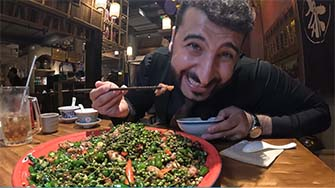

# Savor Má Là: Chongqing Jianghu Cuisine Guide

<Chinese word="麻辣">
<template #pinyin>má là</template>
</Chinese>

Chongqing cuisine can itself be seen as a subcategory of Sichuan cuisine, particularly known as Chongqing <Speech>江湖菜</Speech>(Jianghu cuisine).

It's known for its bold and spicy flavors, reflecting the culinary traditions of the local "jianghu" or "river and lake" culture. This term often connotes a more rustic and less refined style of cooking compared to formal Sichuanese cuisine, with an emphasis on hearty and flavorful dishes.

## Chicken Cuisine

### Spicy Chili Chicken

<Chinese word="辣子鸡">
<template #pinyin>là zǐ jī</template>
Spicy Chili Chicken
</Chinese>

### Sliced Green Pepper Chicken

<Chinese word="尖椒鸡">
<template #pinyin>jiān jiāo jī</template>
Sliced Green Pepper Chicken
</Chinese>

The main ingredients for <Speech>尖椒鸡</Speech>(Sliced Green Pepper Chicken) include chicken, green peppers, dried chili peppers, and other seasonings such as Sichuan peppercorns, ginger, and garlic.

In addition to Sliced Green Pepper Chicken, there are also <Speech>尖椒兔</Speech>(Spicy Pepper Rabbit) and <Speech>花椒鸡</Speech>(Sichuan Peppercorn Chicken). These dishes share similarities in appearance, preparation methods, and flavors, but each has its own unique taste.

<YouTube link="https://youtu.be/rNs1n45_xfk?si=-06fiV4QdaCcUfzU">
<template #cover></template>
<template #title>lost the sense of taste | فقدت حاسة التذوق بسبب الفلفل </template>
<template #author>Lao Wang in China</template>
<template #description>In an ancient inn in Chongqing, a table full of Jianghu cuisine, where the spiciness erases all worries! It's spicy enough to make your face expressive and lose your sense of taste! But it's so good, it's really delicious.</template>
</YouTube>

### Taro Chicken

<Chinese word="芋儿鸡">
<template #pinyin>yù ér jī</template>
Taro Chicken
</Chinese>

### Spring Water Chicken

<Chinese word="泉水鸡">
<template #pinyin>quán shuǐ jī</template>
Spring Water Chicken
</Chinese>

## County Cuisine

### Bishan Rabbit

<Chinese word="璧山兔">
<template #pinyin>bì shān tù</template>
Bishan Rabbit
</Chinese>

### Laifeng Fish

<Chinese word="来凤鱼">
<template #pinyin>lái fèng yú</template>
Laifeng Fish
</Chinese>

### Wanzhou-style Grilled Fish

<Chinese word="万州烤鱼">
<template #pinyin>wàn zhōu kǎo yú</template>
Wanzhou-style Grilled Fish
</Chinese>

### Qianjiang-style Chicken Offal

<Chinese word="黔江鸡杂">
<template #pinyin>qián jiāng jī zá</template>
Qianjiang-style Chicken Offal
</Chinese>