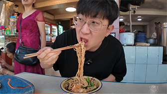
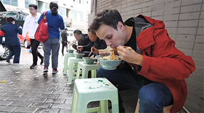

# Must-Try: Chongqing Noddles: Xiaomian & Hidden Treats

## Xiaomian

<Chinese word="小面">
<template #pinyin>xiǎo miàn</template>
<template #ipa>/ʃəʊ miːn/</template>
Small Noddles
</Chinese>

<Description>

<i>Type</i><b>Meal</b>

<i>Ingredients</i><b>Wheat Flour</b>

<i>Flavor</i><b>Adjustable Spiciness</b>

<i>Price</i><b><CNY>8</CNY> to <CNY>15</CNY></b>

<i>Vegetarian</i><b>Can Be Made</b>

<i>Note</i><b>May Contain Pork</b>

<i>Recommendation</i><b>Strongly Recommended</b>

<i>Dining Duration</i><b>Minutes</b>

<i>Dining Method</i><b>Dine-in</b>

<i>Commonness</i><b>Very Common</b>

</Description>

Xiaomian is the most famous noodles in Chongqing, known for its spicy and numbing flavor. The noodles are typically made from high-gluten flour, and its main characteristics are its spicy condiments and simple garnishes such as crushed peanuts, scallions, Sichuan pepper powder, and chili oil.

<YouTube link="https://youtu.be/ZehhL5mXV4c?si=KvMraWn0R9m9woSD&t=80">
<template #cover></template>
<template #title>My Italian Family Tried Chongqing Noodles for the First Time</template>
<template #author>Luca&Rachele</template>
<template #description>My Italian family's first visit to the mountain city of Chongqing, marveling at its beauty! Chongqing noodles really suit Italian palates.</template>
</YouTube>

<YouTube link="https://youtu.be/PK8h0rr9c_U?si=WE6ddHRMAapWGgrc&t=24">
<template #cover></template>
<template #title>How do people in Chongqing wake up to a spicy broth?</template>
<template #author>大一的吃货生活</template>
<template #description>Noodles with bone broth are perfect.</template>
</YouTube>

## Mashed Pea and Minced Pork Xiaomian

<Chinese word="碗杂小面">
<template #pinyin>wǎn zá xiǎo miàn</template>
<template #ipa>/ʃəʊ miːn/</template>
Mashed Pea and Minced Pork Xiaomian
</Chinese>

<Description>

<i>Type</i><b>Meal</b>

<i>Ingredients</i><b>Wheat Flour, Pork</b>

<i>Flavor</i><b>Adjustable Spiciness</b>

<i>Price</i><b><CNY>16</CNY> to <CNY>20</CNY></b>

<i>Vegetarian</i><b>Can Be Made</b>

<i>Note</i><b>Contain Pork</b>

<i>Recommendation</i><b>Recommended</b>

<i>Dining Duration</i><b>Minutes</b>

<i>Dining Method</i><b>Dine-in</b>

<i>Commonness</i><b>Very Common</b>

</Description>

A combination of mashed peas and minced pork sauce creates a noodle dish with distinct layers of sweetness and savory flavors.

<YouTube link="https://youtu.be/NX7Pjd92Hdo?si=s9VLFz8GuSKzzjOt&t=168">
<template #cover></template>
<template #title>I found heaven in Chongqing and I'M NEVER LEAVING!</template>
<template #author>Blondie in China</template>
<template #description>I'm taking on the challenge of seeing how much delicious food I can get for 50 RMB. Sitting on the curb next to the surreal 3D cityscape, eating Chongqing noodles, is truly a fantastic experience.</template>
</YouTube>

## Rice Noodles

<Chinese word="米线">
<template #pinyin>mǐ xiàn</template>
Rice Noddles
</Chinese>

<Description>

<i>Type</i><b>Meal</b>

<i>Ingredients</i><b>Rice</b>

<i>Flavor</i><b>Adjustable Spiciness</b>

<i>Price</i><b><CNY>8</CNY> to <CNY>15</CNY></b>

<i>Vegetarian</i><b>Can Be Made</b>

<i>Note</i><b>May Contain Pork</b>

<i>Recommendation</i><b>Recommended</b>

<i>Dining Duration</i><b>Minutes</b>

<i>Dining Method</i><b>Dine-in</b>

<i>Commonness</i><b>Very Common</b>

</Description>

In Chongqing, rice noodles are just as popular as xiaomian, and their preparation is largely similar to that of small noodles, with variations such as beef rice noodles and chicken offal rice noodles being common options.

<YouTube link="https://youtu.be/Hgq1LoAqMgg?si=P5VjeSEI-fVuQ-g_&t=616">
<template #cover></template>
<template #title>The BEST Noodles in the WORLD!!! Chinese FIRE NOODLE + </template>
<template #author>The Food Ranger</template>
<template #description>Street Food Tour of Chongqing - EXTREME!!!</template>
</YouTube>

## Chaoshou

<Chinese word="抄手">
<template #pinyin>chāo shǒu</template>
Wonton
</Chinese>

<Description>

<i>Type</i><b>Meal</b>

<i>Ingredients</i><b>Wheat Flour, Pork</b>

<i>Flavor</i><b>Adjustable Spiciness</b>

<i>Price</i><b><CNY>16</CNY> to <CNY>25</CNY></b>

<i>Vegetarian</i><b>No</b>

<i>Note</i><b>May Contain Pork</b>

<i>Recommendation</i><b>Normal</b>

<i>Dining Duration</i><b>Minutes</b>

<i>Dining Method</i><b>Dine-in</b>

<i>Commonness</i><b>Very Common</b>

</Description>

In Chinese culinary culture, <Speech>抄手</Speech>(Chao Shou), <Speech>饺子</Speech>(Dumplings), and <Speech>馄饨</Speech>(Wontons) are all popular traditional foods. Although they share some similarities in appearance, there are distinct differences in their preparation methods, shapes, and ways of eating.

<Speech>抄手</Speech>(Chao Shou) usually have pork as the main ingredient, and sometimes other meats such as shrimp or chicken are added, along with seasonings like scallions and ginger. The wrapper is thin and soft, typically using specialized Chao Shou wrappers that are smaller and more delicate than dumpling wrappers. Chongqing-style Chao Shou generally has a richer and spicier flavor profile.

<YouTube link="https://youtu.be/vLV_43p_3qU?si=sI-jptDxGbSUyOgQ&t=1888">
<template #cover></template>
<template #title>Exploring Ancient Town in Chongqing, China</template>
<template #author>Two Mad Explorers</template>
<template #description>We're exploring an ancient town on the outskirts of Chongqing and successfully found our way into a Chongqing restaurant where traditional noodles and chicken soup chaoshou made a lasting impression.</template>
</YouTube>

## Sour and Spicy Noddles

<Chinese word="酸辣粉">
<template #pinyin>suān là fěn</template>
Sour and Spicy Noddles
</Chinese>

<Description>

<i>Type</i><b>Meal, Snack</b>

<i>Ingredients</i><b>Sweet Potato Flour</b>

<i>Flavor</i><b>Adjustable Spiciness</b>

<i>Price</i><b><CNY>6</CNY> to <CNY>10</CNY></b>

<i>Vegetarian</i><b>Can Be Made</b>

<i>Note</i><b>-</b>

<i>Recommendation</i><b>Normal</b>

<i>Dining Duration</i><b>Minutes</b>

<i>Dining Method</i><b>Dine-in, Take-away</b>

<i>Commonness</i><b>Common</b>

</Description>

It can be considered a main meal or a street food; you can find it in noodle shops, but more often it's available at snack bars.

People love sour and spicy sweet potato noddles for several reasons. Its tangy and spicy flavor provides a delightful taste experience that is both refreshing and invigorating. The chewy texture of the sweet potato noodles adds an interesting mouthfeel. It's also versatile, serving as both a satisfying main dish or a quick, tasty snack. Additionally, it’s often affordable and widely available, making it a popular choice for many, especially at snack bars and street food stalls.

## Cold Noodles

<Chinese word="凉面">
<template #pinyin>liáng miàn</template>
Cold Noodles
</Chinese>

<Description>

<i>Type</i><b>Meal</b>

<i>Ingredients</i><b>Wheat Flour</b>

<i>Flavor</i><b>Adjustable Spiciness</b>

<i>Price</i><b><CNY>8</CNY> to <CNY>15</CNY></b>

<i>Vegetarian</i><b>Can Be Made</b>

<i>Note</i><b>May Contain Pork</b>

<i>Recommendation</i><b>Recommended</b>

<i>Dining Duration</i><b>Minutes</b>

<i>Dining Method</i><b>Dine-in</b>

<i>Commonness</i><b>Very Common</b>

</Description>

They are quite similar to other types of noodles, but what sets them apart is that they can be eaten as a snack. That's why you often see them being sold on the roadside in scenic areas. cold noodles typically garnished with crushed peanuts, cucumber strips, soy sauce, and vinegar.

In the summer, when the weather is particularly hot, locals might even have congee and cold noodles as their main meal due to their refreshing combination.
