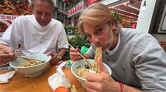
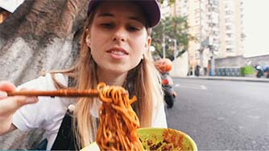
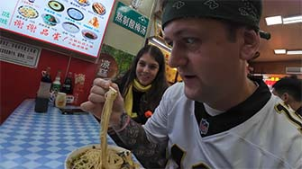

# Guide to Chongqing Noodles: Xiaomian & Hidden Treats

## Xiaomian

<Chinese word="小面">
<template #pinyin>xiǎo miàn</template>
<template #ipa>/ʃəʊ miːn/</template>
Small Noddles
</Chinese>

Xiaomian is the most famous noodles in Chongqing, known for its spicy and numbing flavor. The noodles are typically made from high-gluten flour, and its main characteristics are its spicy condiments and simple garnishes such as crushed peanuts, scallions, Sichuan pepper powder, and chili oil.

<YouTube link="https://youtu.be/ZehhL5mXV4c?si=KvMraWn0R9m9woSD&t=80">
<template #cover></template>
<template #title>My Italian Family Tried Chongqing Noodles for the First Time</template>
<template #author>Luca&Rachele</template>
<template #description>My Italian family's first visit to the mountain city of Chongqing, marveling at its beauty! Chongqing noodles really suit Italian palates.</template>
</YouTube>

The per capita cost for Xiaomian is around <u><CNY>8</CNY> to <CNY>15</CNY></u>.

### Portion

Noodles are typically offered in two sizes, <Speech>二两</Speech>(100 grams) and <Speech>三两</Speech>(150 grams).

::: info LOCAL TIPS
Generally, 100 grams is enough to fill you up, though someone with a larger appetite might go for 300 grams. Typically, locals also add a <Speech>煎蛋</Speech>(fried egg) to their order.
:::

### Varieties

Xiaomian come in various shapes and textures that cater to different preferences. 

<table>
  <thead>
    <tr>
      <th>Shapes</th>
      <th>Shapes</th>
      <th>Width</th>
      <th>Suitability</th>
    </tr>
  </thead>
  <tbody>
    <tr>
      <td><Speech>细面</Speech>(Thin Noodles)</td>
      <td>Round</td>
      <td>2mm</td>
      <td>Recommended, The Most Common</td>
    </tr>
    <tr>
      <td><Speech>韭菜叶</Speech>(Leek Leaf Noodles)</td>
      <td>Flat</td>
      <td>5mm</td>
      <td>Recommended, Hidden Specialty</td>
    </tr>
    <tr>
      <td><Speech>宽面</Speech>(Wide Noodles)</td>
      <td>Flat</td>
      <td>10mm</td>
      <td>Recommended</td>
    </tr>
  </tbody>
</table>

::: info LOCAL TIPS
Leek leaf small noodles are typically known only by locals and not available at every noodle shop; even when they are, the supply is limited. But if you're fortunate enough to try them, it will be a unique experience.
:::

### Soup Style

Of course, you'll need to choose your level of spiciness.

<table>
  <thead>
    <tr>
      <th>Soup</th>
      <th>Spiciness</th>
      <th>Suitability</th>
    </tr>
  </thead>
  <tbody>
    <tr>
      <td><Speech>清汤</Speech>(Clear Soup)</td>
      <td>Non-spicy 🥬</td>
      <td>Recommended</td>
    </tr>
    <tr>
      <td><Speech>微辣</Speech>(Mild Spicy)</td>
      <td>🌶️</td>
      <td>Recommended, Locals Favorite</td>
    </tr>
    <tr>
      <td><Speech>重辣</Speech>(Spicy)</td>
      <td>🌶️🌶️</td>
      <td>Locals Only</td>
    </tr>
  </tbody>
</table>

::: info Tips
Some vendors may include lard in their noodles seasoning. If you are concerned, please inform the server before ordering — '<Speech>不要有猪肉猪油的东西</Speech>nothing with pork or pork lard, please.'
:::

### Dry-tossed Style

Although noodle soup is the most common form of Xiaomian, a significant number of locals opt for the dry version, known as <Speech as="甘溜">干溜</Speech>(dry-tossed style).

### Hand-Sliced Noodles

### Adaptations

Chongqing Xiaomian, renowned for its rich variations and distinctive flavors, offers many adaptations beyond the classic spicy version. 
- <Speech>牛肉面</Speech>(Beef Noodles): 🌶️ They features tender, braised beef as the main topping, usually served in a specially prepared spicy broth that complements the beef’s richness.
- <Speech>肥肠面</Speech>(Pig Intestine Noodles): 🌶️ Using thoroughly cleaned and seasoned pig intestine as the primary ingredient, this type of noodle soup is characterized by its unique texture and flavor.
- <Speech>豌杂面</Speech>(Mashed Pea and Minced Pork Noodles): A combination of mashed peas and minced pork sauce creates a noodle dish with distinct layers of sweetness and savory flavors.
- <Speech>鸡杂面</Speech>(Chicken Offal Noodles): 🌶️ Incorporates chicken giblets such as gizzards, hearts, and livers as toppings, offering a diverse range of textures and tastes.

<YouTube link="https://youtu.be/NX7Pjd92Hdo?si=s9VLFz8GuSKzzjOt&t=168">
<template #cover></template>
<template #title>I found heaven in Chongqing and I'M NEVER LEAVING!</template>
<template #author>Blondie in China</template>
<template #description>I'm taking on the challenge of seeing how much delicious food I can get for 50 RMB. Sitting on the curb next to the surreal 3D cityscape, eating Chongqing noodles, is truly a fantastic experience.</template>
</YouTube>

### Environment

Small noodle shops are usually roadside establishments that offer square tables and stools. However, there is a type called 'stool noodle' shops where, due to limited space, high and low stools are used as dining tables; in some cases, there might not even be stools available. Even such conditions don't deter locals from savoring the delicious food.

## Cold Noodles

<Chinese word="凉面">
<template #pinyin>liáng miàn</template>
Cold Noodles
</Chinese>

They are quite similar to other types of noodles, but what sets them apart is that they can be eaten as a snack. That's why you often see them being sold on the roadside in scenic areas. <Speech>凉面</Speech>(Cold Noodles) typically garnished with crushed peanuts, cucumber strips, soy sauce, and vinegar.

In the summer, when the weather is particularly hot, locals might even have <Speech>稀饭</Speech>(congee) and <Speech>凉面</Speech>(Cold Noodles) as their main meal due to their refreshing combination.

## Rice Noddles

<Chinese word="米线">
<template #pinyin>mǐ xiàn</template>
Rice Noddles
</Chinese>

In Chongqing, <Speech>米线</Speech>(rice noodles) are just as popular as small noodles, and their preparation is largely similar to that of small noodles, with variations such as beef rice noodles and chicken offal rice noodles being common options.

### Clay Pot Rice Noodle

Chongqing's <Speech>砂锅米线</Speech>(Clay Pot Rice Noodle) is very popular, especially during cold weather, as a steaming bowl can quickly warm the body and soul.

### Chicken Broth Rice Noodles

Chongqing's <Speech>鸡汁米线</Speech>(Chicken Broth Rice Noodle) is a popular dish in Chongqing, known for its rich and flavorful broth.

## Chaoshou

<Chinese word="抄手">
<template #pinyin>chāo shǒu</template>
Wonton
</Chinese>

In Chinese culinary culture, <Speech>抄手</Speech>(Chao Shou), <Speech>饺子</Speech>(Dumplings), and <Speech>馄饨</Speech>(Wontons) are all popular traditional foods. Although they share some similarities in appearance, there are distinct differences in their preparation methods, shapes, and ways of eating.

<Speech>抄手</Speech>(Chao Shou) usually have pork as the main ingredient, and sometimes other meats such as shrimp or chicken are added, along with seasonings like scallions and ginger. The wrapper is thin and soft, typically using specialized Chao Shou wrappers that are smaller and more delicate than dumpling wrappers. Chongqing-style Chao Shou generally has a richer and spicier flavor profile.

<YouTube link="https://youtu.be/vLV_43p_3qU?si=sI-jptDxGbSUyOgQ&t=1888">
<template #cover></template>
<template #title>Exploring Ancient Town in Chongqing, China</template>
<template #author>Two Mad Explorers</template>
<template #description>We're exploring an ancient town on the outskirts of Chongqing and successfully found our way into a Chongqing restaurant where traditional noodles and chicken soup chaoshou made a lasting impression.</template>
</YouTube>

## Sour and Spicy Sweet Potato Noddles

<Chinese word="酸辣粉">
<template #pinyin>suān là fěn</template>
Sour and Spicy Sweet Potato Noddles
</Chinese>

It can be considered a main meal or a street food; you can find it in noodle shops, but more often it's available at snack bars.

People love sour and spicy sweet potato noddles for several reasons. Its tangy and spicy flavor provides a delightful taste experience that is both refreshing and invigorating. The chewy texture of the sweet potato noodles adds an interesting mouthfeel. It's also versatile, serving as both a satisfying main dish or a quick, tasty snack. Additionally, it’s often affordable and widely available, making it a popular choice for many, especially at snack bars and street food stalls.