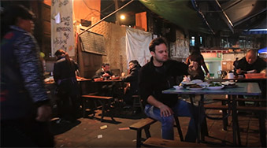

# Must-Try: Chongqing's Home Cooking: Sichuan Cuisine

Chongqing's home-style cuisine has close ties with Sichuan cuisine, but it has also developed its own unique style and characteristics. Historically, Chongqing cuisine is a branch of Sichuan cuisine, but over time, it has gradually formed its own set of culinary philosophies and flavor profiles.

## Bean Curd with Rice

<Chinese word="豆花饭">
<template #pinyin>dòu huā fàn</template>
Bean Curd with Rice
</Chinese>

<Description>

<i>Type</i><b>Meal</b>

<i>Ingredients</i><b>Soybean</b>

<i>Flavor</i><b>Adjustable Spiciness</b>

<i>Price</i><b><CNY>6</CNY>(additional charges for ordering)></b>

<i>Vegetarian</i><b>Yes</b>

<i>Recommendation</i><b>Strongly Recommended</b>

<i>Dining Duration</i><b>Minutes</b>

<i>Dining Method</i><b>Dine-in</b>

<i>Commonness</i><b>Common</b>

</Description>

The main ingredient of douhua rice is smooth douhua (tofu pudding), served with condiments, rice, and other dishes, forming a simple yet delicious meal.

<YouTube link="https://youtu.be/XbbREufg8z4?si=B3tnZJ9hNqq755gN&t=428">
<template #cover></template>
<template #title>Chinese Street Food Tour in Chongqing, China | BEST Alleyway Food in China</template>
<template #author>The Food Ranger</template>
<template #description>I made my way to Chongqing, in search of the best Chinese street food and unique Chinese Sichuan food. I found a ton of street food and specialty Chongqing snacks. There was a lot of Chinese street food on every corner.</template>
</YouTube>

## Fish-Flavored Shredded Pork

<Chinese word="鱼香肉丝">
<template #pinyin>yú xiāng ròu sī</template>
Fish-Flavored Shredded Pork
</Chinese>

## Kung Pao Chicken

<Chinese word="宫保鸡丁">
<template #pinyin>gōng bǎo jī dīng</template>
Kung Pao Chicken
</Chinese>

## Twice-Cooked Pork

<Chinese word="回锅肉">
<template #pinyin>huí guō ròu</template>
Twice-Cooked Pork
</Chinese>

## Mapo Tofu

<Chinese word="麻婆豆腐">
<template #pinyin>má pó dòu fǔ</template>
Mapo Tofu
</Chinese>

## Dry-Fried Green Beans

<Chinese word="干煸四季豆">
<template #pinyin>gān biān sì jì dòu</template>
Dry-Fried Green Beans
</Chinese>

## Gross Blood in Mong Kok

<Chinese word="毛血旺">
<template #pinyin>máo xuè wàng</template>
Gross Blood in Mong Kok
</Chinese>

## Boiled Fish with Pickled Cabbage and Chili

<Chinese word="酸菜鱼">
<template #pinyin>suān cài yú</template>
Boiled Fish with Pickled Cabbage and Chili
</Chinese>