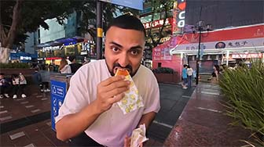
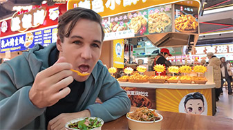

# Must-Try: Discover Chongqing's Hidden Street Eats

## Fried Rice Flour Triangle

<Chinese word="三角粑">
<template #pinyin>sān jiǎo bā</template>
Fried Rice Flour Triangle
</Chinese>

<Description>

<i>Type</i><b>Snack</b>

<i>Ingredients</i><b>Rice</b>

<i>Price</i><b><CNY>2</CNY></b>

<i>Vegetarian</i><b>Yee</b>

<i>Note</i><b>-</b>

<i>Recommendation</i><b>Strongly Recommend</b>

<i>Dining Duration</i><b>Minutes</b>

<i>Dining Method</i><b>Take-away</b>

<i>Commonness</i><b>Normal</b>

</Description>

Fried Rice Flour Triangle is a traditional snack from Chongqing. Vendors typically bake it on-site using a triangular iron mold. When freshly baked, it has a golden, crispy outer layer and a soft, sweet inner filling. It is inexpensive and easy to make, and it's very popular among locals, serving as a childhood memory for many.

::: info LOCAL TIPS
Traditionally, it is plain with no fillings.
:::

<YouTube link="https://youtu.be/SXRvH0SRKlk?si=_QBQVI7tig3BBS6n&t=623">
<template #cover></template>
<template #title>INSANE Street Food in Chongqing, CHINA (2024)</template>
<template #author>KSquared</template>
<template #description>The snacks at the night market in downtown Chongqing are beyond description—so delicious and tempting that it's 'too dangerous' to stop eating.</template>
</YouTube>

## Chongqing-Style Barbecue

### Grilled Sweet Potato Skin

<Chinese word="烤苕皮" as="烤芍皮">
<template #pinyin>kǎo sháo pí</template>
Grilled Sweet Potato Skin
</Chinese>

<Description>

<i>Type</i><b>Snack</b>

<i>Ingredients</i><b>Sweet Potato Skin</b>

<i>Price</i><b><CNY>10</CNY></b>

<i>Vegetarian</i><b>Yes</b>

<i>Note</i><b>-</b>

<i>Recommendation</i><b>Recommend</b>

<i>Dining Duration</i><b>Minutes</b>

<i>Dining Method</i><b>Take-away</b>

<i>Commonness</i><b>Normal</b>

</Description>

<YouTube link="https://youtu.be/j22aObnfhG4?si=xO7KrOkcmKT3NJp2&t=860">
<template #cover></template>
<template #title>Everything I ate in Chongqing, China (ULTIMATE STREET FOOD TOUR)</template>
<template #author>JetLag Warriors</template>
<template #description>Chongqing street food has completely captivated me. Once you get used to the spiciness, it becomes incredibly tasty; but at first, it can be quite a tingling surprise. I would give it a five-star rating.</template>
</YouTube>

### Grilled Tofu Block

<Chinese word="烤豆腐干">
<template #pinyin>kǎo dòu fǔ gàn</template>
Grilled Tofu Block
</Chinese>

<Description>

<i>Type</i><b>Snack</b>

<i>Ingredients</i><b>Tofu Skin</b>

<i>Price</i><b><CNY>10</CNY></b>

<i>Vegetarian</i><b>Yes</b>

<i>Note</i><b>-</b>

<i>Recommendation</i><b>Recommend</b>

<i>Dining Duration</i><b>Minutes</b>

<i>Dining Method</i><b>Take-away</b>

<i>Commonness</i><b>Normal</b>

</Description>

### Grilled Rice Cake

<Chinese word="烤年糕">
<template #pinyin>kǎo nián gāo</template>
Grilled Rice Cake
</Chinese>

<Description>

<i>Type</i><b>Snack</b>

<i>Ingredients</i><b>Rice Cake</b>

<i>Price</i><b><CNY>10</CNY></b>

<i>Vegetarian</i><b>Yes</b>

<i>Note</i><b>-</b>

<i>Recommendation</i><b>Recommend</b>

<i>Dining Duration</i><b>Minutes</b>

<i>Dining Method</i><b>Take-away</b>

<i>Commonness</i><b>Normal</b>

</Description>

### Grilled Pig Brain

<Chinese word="烤脑花">
<template #pinyin>kǎo nǎo huā</template>
Grilled Pig Brain
</Chinese>

<Description>

<i>Type</i><b>Snack</b>

<i>Ingredients</i><b>Pig Brain</b>

<i>Price</i><b><CNY>20</CNY></b>

<i>Vegetarian</i><b>No</b>

<i>Note</i><b>Contains Pig Brain</b>

<i>Recommendation</i><b>Divisive</b>

<i>Dining Duration</i><b>Minutes</b>

<i>Dining Method</i><b>Dine-in, Take-away</b>

<i>Commonness</i><b>Normal</b>

</Description>

<YouTube link="https://youtu.be/vTCuLOAKbgQ?si=rAmlN0TlDvd2eXrg&t=261">
<template #cover></template>
<template #title>Chongqing Food Street</template>
<template #author>Tucker Eats</template>
<template #description>Not just brains, other things I don’t really enjoy too, the grilled frog however. It’s a grilled delight. I’d insert a frog pun here, but I’m not clever enough. There’s also mashed potato and a baked durian.</template>
</YouTube>

The main ingredient of grilled brain flower is pig's brain, which is typically cooked with various spices and seasonings. The pig's brain is placed on charcoal or an electric grill to be roasted. During the grilling process, ingredients such as chili peppers, Sichuan peppercorns, minced garlic, and cilantro are added, giving the grilled brain flower its characteristic spicy, numbing, fresh, and fragrant flavor.

Not all locals can accept this dish; many people dislike its taste, and many cannot stomach the idea of eating it. Moreover, it has a high cholesterol content, and eating too much of it is not beneficial.