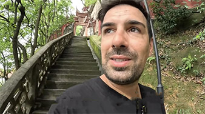

# Chongqing's Cultural: the Ba-Yu Heritage

Chongqing historically was part of the ancient states of Ba and Shu. Ba-Yu culture combines elements from the ancient Ba people and various subsequent cultures, forming its own unique style. Chongqing is home to many significant historical sites, such as the Dazu Rock Carvings and Baidi City. Ancient poets and scholars have left behind numerous poems praising the natural scenery of the Ba-Yu region.

## Laojundong

<Chinese word="老君洞">
<template #pinyin>lǎo jūn dòng</template>
Laojundong
</Chinese>

<Description>

<i>Best Time to Visit</i><b>Daytime</b>

<i>Activities</i><b>Sightseeing</b>

<i>Crowd Level</i><b>Quiet</b>

<i>Ticket Price</i><b>Free</b>

<i>Recommendation</i><b>Recommended</b>

</Description>

Laojundong is a historic Taoist sanctuary. It is situated on Laojun Mountain at an altitude of approximately 600 meters, facing the Chongqing urban area and offering a commanding view that includes the Chaotianmen Triangle.

<YouTube link="https://youtu.be/Vb0m7_MIWbk?si=NMn6uyeUS8YRjNwU&t=91">
<template #cover></template>
<template #title>THIS IS WHY I LOVE CHINA! Temples, Motorbikes, Markets - Chongqing vlog</template>
<template #author>Ride with Gabi</template>
<template #description>My last video in Chongqing, China. In this video, we are going to check out a beautiful Taoist temple, the ancient town of Chongqing and some Chinese motorbikes.</template>
</YouTube>

<YouTube link="https://youtu.be/ubmyiaAGfns?si=TdQhtyn345Il0VyE&t=1147">
<template #cover></template>
<template #title>la città più ASSURDA che non conoscevi! la CINA è un posto da pazzi!</template>
<template #author>Nicolò Balini</template>
<template #description>Hiking up a mountain in Chongqing to find a Daoist temple, it was dark by the time I arrived; going back the next day, I saw some stunning views of Chongqing from there; Chongqing is worth staying a few more days.</template>
</YouTube>

## Luohan Temple

<Chinese word="罗汉寺">
<template #pinyin>luó hàn sì</template>
Luohan Temple
</Chinese>

<Description>

<i>Best Time to Visit</i><b>Daytime</b>

<i>Activities</i><b>Sightseeing</b>

<i>Crowd Level</i><b>Quiet</b>

<i>Ticket Price</i><b><CNY>20</CNY></b>

<i>Recommendation</i><b>Optional</b>

</Description>

Luohan Temple, initially constructed during the Zhiping period of the Northern Song Dynasty (1064–1067), was renovated in the 11th year of Emperor Guangxu's reign during the Qing Dynasty (1885).

The Great Buddha Hall houses many treasures of Buddhist art, including statues of the Sixteen Arhats; copper cast images of the Three Holy Ones of the West from the Ming Dynasty; a jade Buddha statue of Sakyamuni from Myanmar showing his Enlightenment; and a reproduction of the Indian mural 'Sakyamuni Leaving the Palace and Renouncing the World'.

Within the temple grounds, there is an ancient rock formation over 20 meters long that contains more than 400 Song Dynasty rock-carved Buddha images. Among these are the reclining Buddha in nirvana (commonly known as the 'sleeping Buddha'), Guanyin statues, and images of devotees, all of which exhibit a style similar to that of the Dazu Baoding Hill carvings.

::: info LOCAL TIPS
Luohan Temple is located near Jiefangbei in the center of Chongqing; it is within walking distance. Alternatively, you can take Line 1 of the monirail to Xiaoshizi Station, and it’s just over a hundred meters’ walk away.
:::
