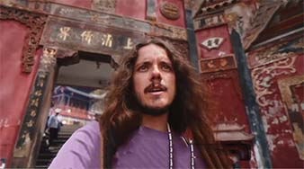

# Dive Deep: the Unique Ba-Yu Culture

Chongqing historically was part of the ancient states of Ba and Shu. Ba-Yu culture combines elements from the ancient Ba people and various subsequent cultures, forming its own unique style. Chongqing is home to many significant historical sites, such as the Dazu Rock Carvings and Baidi City. Ancient poets and scholars have left behind numerous poems praising the natural scenery of the Ba-Yu region.

## Laojundong

<Chinese word="老君洞">
<template #pinyin>lǎo jūn dòng</template>
Laojundong
</Chinese>

Laojundong is a historic Taoist sanctuary. It is situated on Laojun Mountain at an altitude of approximately 600 meters, facing the Chongqing urban area and offering a commanding view that includes the Chaotianmen Triangle.

<YouTube link="https://youtu.be/ubmyiaAGfns?si=TdQhtyn345Il0VyE&t=1147">
<template #cover></template>
<template #title>la città più ASSURDA che non conoscevi! la CINA è un posto da pazzi!</template>
<template #author>Nicolò Balini</template>
<template #description>Hiking up a mountain in Chongqing to find a Daoist temple, it was dark by the time I arrived; going back the next day, I saw some stunning views of Chongqing from there; Chongqing is worth staying a few more days.</template>
</YouTube>

## Dazu Rock Carvings

<Chinese word="大足石刻">
<template #pinyin>dà zú shí kè</template>
The Dazu Rock Carvings
</Chinese>

The Dazu Rock Carvings are a series of Buddhist cave temples and carvings located in Dazu District, Chongqing, China. These rock carvings are renowned for their exceptional artistry and the diversity of their religious subjects, which include not only Buddhism but also Taoism and Confucianism. The carvings span several centuries, from the late Tang Dynasty through the Song Dynasty (650–1250 AD).

These rock carvings not only number in great quantity but also cover a wide range of subjects and contain rich content, encompassing elements from Buddhism, Taoism, Confucianism, and more. They hold significant artistic and historical value. If you plan to visit the Dazu Rock Carvings, it's recommended to allocate sufficient time to appreciate these precious cultural treasures.

::: info LOCAL TIPS
Traveling by high-speed train to Dazu takes around half an hour, but it requires an additional one-hour drive from Dazu Railway Station to the rock carvings. The round-trip travel costs are approximately <CNY>300</CNY>. It is recommended to allow ample time for your visit.
:::

<Map height="40vh" points="105.789404,29.746896,Baoding Mountain Rock Carvings|105.709792,29.713152,Beishan Rock Carvings|105.719822,29.683812,Nanshan Rock Carvings"></Map>

### Baoding Mountain Rock Carvings

Baoding Mountain is considered the highlight of the Dazu Rock Carvings, featuring grand scale, exquisite carving, and rich content.

### Beishan Rock Carvings

Beishan Rock Carvings are known for their continuity and systematic nature, reflecting changes and developments in Buddhist sculpture during the Tang and Song dynasties.

### Nanshan Rock Carvings

Nanshan Rock Carvings primarily feature Taoist sculptures, which are an important part of Chinese Taoist rock art.
