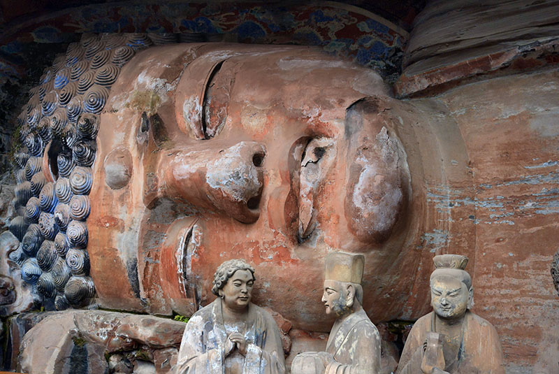
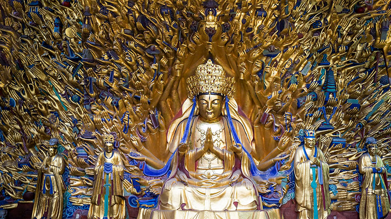
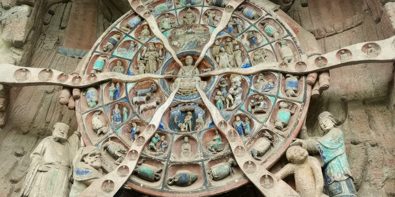

# Explore Dazu Rock Carvings: Ancient Buddhist Art

<Chinese word="大足石刻">
<template #pinyin>dà zú shí kè</template>
The Dazu Rock Carvings
</Chinese>

The Dazu Rock Carvings are a series of Buddhist cave temples and carvings located in Dazu District, Chongqing. These rock carvings are renowned for their exceptional artistry and the diversity of their religious subjects, which include not only Buddhism but also Taoism and Confucianism. The carvings span several centuries, from the late Tang Dynasty through the Song Dynasty (650–1250 AD).

These rock carvings not only number in great quantity but also cover a wide range of subjects and contain rich content, encompassing elements from Buddhism, Taoism, Confucianism, and more.

In 1999, the Dazu Rock Carvings were inscribed on the UNESCO World Heritage List.

::: info LOCAL TIPS
Traveling by high-speed train to Dazu takes around half an hour, but it requires an additional one-hour drive from Dazu Railway Station to the rock carvings. The round-trip travel costs are approximately <CNY>300</CNY>. If you plan to visit, it's recommended to allocate sufficient time to appreciate these precious cultural treasures.
:::

### Baoding Mountain Rock Carvings

Baoding Mountain is considered the highlight of the Dazu Rock Carvings, featuring grand scale, exquisite carving, and rich content. The most famous part is Dafo Bay.

#### Dafo Bay

The cliff face at Dafo Bay is about 500 meters long and ranges from 8 to 25 meters in height. The sculptures are carved into the east, south, and north cliff walls. They include images of protective deities, the Wheel of Transmigration, the Vast Treasure Pavilion, the Three Saints of Huayan, the Thousand-Armed Guanyin, and the Holy Scene of the Nirvana of Śākyamuni, among others. All the sculptures are richly detailed, with no niche repeated.

##### The Holy Scene of the Nirvana of Śākyamuni

The Holy Scene of the Nirvana of Śākyamuni is an important work among the Dazu Rock Carvings. This carving depicts the scene of the Buddha's Parinirvana, which is the passing away of the historical Buddha, Siddhartha Gautama, in Buddhist tradition. In this carving, the Buddha is depicted in a reclining position, symbolizing his liberation from physical death and entry into final Nirvana, or complete release from the cycle of birth and death.

The specific construction period of it can be traced back to the Southern Song Dynasty, approximately between 1174 and 1252 AD.

##### The Thousand-Armed Guanyin

The Thousand-Armed Guanyin is a very famous and precious Buddhist rock-carving art work in the Dazu Rock Carvings. The niche stands 7.2 meters high and 12.5 meters wide, covering a total area of 88 square meters. It is the largest extant rock carving that integrates sculpture, gilding, and polychromy. It was carved during the Southern Song Dynasty, from the Chunxi period to the end of the Southern Song (approximately 1174 to 1252 AD). The arms of the Thousand-Armed Guanyin extend layer by layer from the cliff face, each in a different posture; some fingers are stretched out flat, while others hold religious implements delicately, creating a vivid and lifelike form.

##### The Wheel of Transmigration

The Wheel of Transmigration is an important piece in the Dazu Rock Carvings. This work depicts the Buddhist concept of the Six Realms of Existence, which includes the realms of Heaven, Asuras, Humans, Animals, Hungry Ghosts, and Hell. The Wheel of Transmigration illustrates through intricate carvings the process by which beings cycle through these different states of existence based on their karma.

The specific construction period of it can be traced back to the Southern Song Dynasty until the end of the Southern Song, approximately between 1174 and 1252 AD.

### Beishan Rock Carvings

Beishan Rock Carvings are known for their continuity and systematic nature, reflecting changes and developments in Buddhist sculpture during the Tang and Song dynasties.

### Nanshan Rock Carvings

Nanshan Rock Carvings primarily feature Taoist sculptures, which are an important part of Chinese Taoist rock art.
