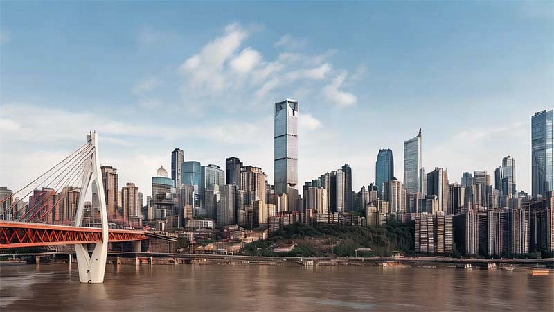

# Chongqing's First Impressions: Your Arrival Guide

## Night View from Above

Chongqing's night views are incredibly famous. Should you happen to arrive in Chongqing at night, opting for a window seat on **the left side** of the aircraft gives you <u>a 50% chance (determined by wind direction) to witness the beautiful urban night scenery of Chongqing</u> just before the plane lands.

> The runway numbers at Chongqing Jiangbei International Airport are 02/20. Runway 02 is used for landings and takeoffs on a heading of north-east. The approach path for this runway happens to pass over the most beautifully lit urban area of Chongqing, presenting a stunning night view. Whether Runway 02 or Runway 20 is used for actual landings depends on the wind direction. Planes typically land into the wind, so when there is a southwest wind, there's a high probability that planes will be landing on Runway 02.

If you're fortunate enough, as the plane clears the final mountain and makes its last right-hand maneuver, you'll catch sight of the Chongqing urban area, with only a few minutes remaining until touchdown.

## Arrival

<Youtube href="https://youtu.be/rZb_P7xDVJo?si=K3LCgMCUFiqGQIXr&t=391" title="Entering The LARGEST City in the WORLD (Chongqing, China) 🇨🇳 - KSquared">

</Youtube>

### Yellow Taxis

<Flex>

You won't need any guide to find them; bright yellow taxis will surely greet you upon exiting the airport, ready to take you into the city.

The taxi fare from Chongqing Jiangbei International Airport to Downtown is approximately 70 RMB (around 9 Euros).

Alternatively, you can reach the city center by taking the metro.

</Flex>

## Stays

You may choose to stay at a hotel in the city center, which is conveniently close to all the internet-famous attractions. A classic itinerary would be: start with a walk to Kuixinglou, marveling at Chongqing’s unique topography where what appears to be the first floor is actually the twentieth level; then, take Line 2 of the light rail to Liziba Station, to witness the extraordinary spectacle of the train passing right through a building.

<Map height="40vh" center="106.552003,29.562696" :zoom="13" driving="106.638691,29.717337,airport|106.577708,29.567822,Skyline Viewpoint|106.587897,29.565634,Raffles" points="106.578953,29.562165,Hongyadong|106.530586,29.550659,Liziba Monorail Piercing Building|106.587897,29.565634,Raffles|106.582809,29.557813,Yangtze River Cable Car|106.573579,29.559729,Kuixinglou"></Map>

> If your route takes you across the Qiansimen Bridge, you'll be treated to a magnificent skyline view of Chongqing just before ascending the bridge.

## Prices

Some basic food items in China, such as rice, noodles, and cooking oil, typically have lower prices. In European and American countries, the prices of meat and dairy products are often more reasonable.

| Item             | Prince in China | Price in Europe |
| :--------------- | :-------------- | :-------------- |
| Cola 500ml       | €0.4            | €1.5            |
| Mineral Water 5L | €1.1            | €6L             |
| Beef 500g        | €9              | €3              |
| Tomato 500g      | €0.2            | €3              |
| Apple 500g       | €0.2            | €2              |

<Youtube href="https://youtu.be/6-5wmhpnT_k?si=EWA77ir71zaZr9sI" title="Full Supermarket Tour in China 🇨🇳 (Shocking Prices) - Two Mad Explorers">

</Youtube>