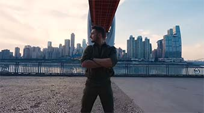
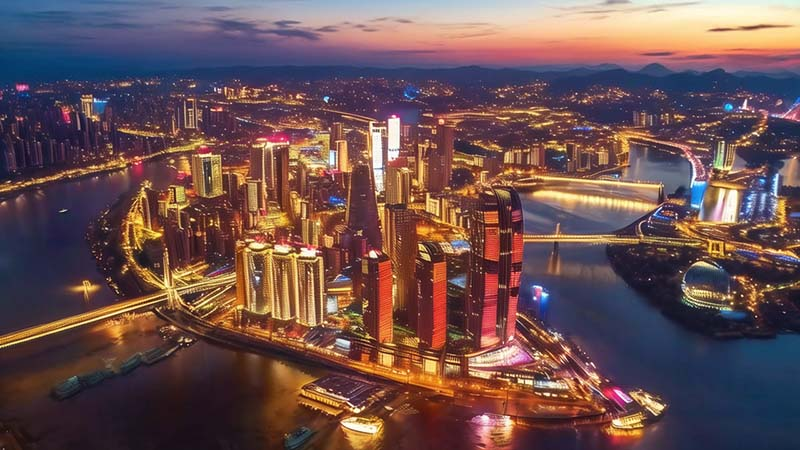
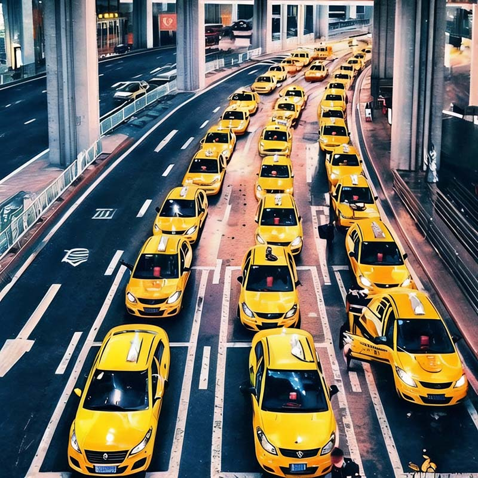
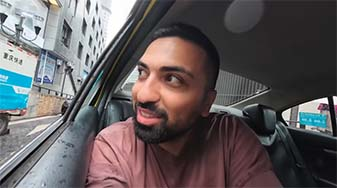
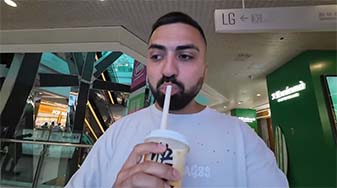
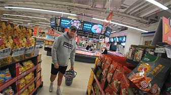

# Chongqing's First Impressions: Your Arrival Guide

## Overview

Chongqing's population exceeds 30 million, making it one of the most populous cities in the world. The total area of Chongqing is approximately 82,300 square kilometers, which is roughly the same size as Serbia and twice the size of the Netherlands.

Chongqing's Nicknames:
- **The Bridge City**: Chongqing, with its numerous rivers, has constructed over 20,000 bridges to connect land and span valleys.
- **Mountain Metropolis**: Surrounded by mountains, Chongqing's urban architecture follows the natural topography, creating a unique '8D landscape' with buildings at varying elevations.
- **Fog Capital**: Chongqing has a subtropical humid climate, characterized by high humidity and frequent fog. Especially during autumn and winter, thick mist often shrouds the city in the early morning hours.
- **Hotpot Capital**: Chongqing is the birthplace of hotpot and is home to over 32,000 hotpot restaurants. By the way, Chongqing is also home to over 80,000 small noodle shops.

<Youtube link="https://youtu.be/0kfhyOKM888?si=AzCMWcMNKhRYBnCb">
<template #cover></template>
<template #title>The Biggest City on Earth You've Never Heard Of</template>
<template #author>PPPeter</template>
<template #description>With population of 32,000,000, Chongqing, China is the biggest city on Earth. Its unbelievable area makes it also the largest city in the world.</template>
</Youtube>

## Night View from Above

Chongqing's night views are incredibly famous. Should you happen to arrive in Chongqing at night, opting for a window seat on **the left side** of the aircraft gives you <u>a 50% chance (determined by wind direction) to witness the beautiful urban night scenery of Chongqing</u> just before the plane lands.

> The runway numbers at Chongqing Jiangbei International Airport are 02/20. Runway 02 is used for landings and takeoffs on a heading of north-east. The approach path for this runway happens to pass over the most beautifully lit urban area of Chongqing, presenting a stunning night view. Whether Runway 02 or Runway 20 is used for actual landings depends on the wind direction. Planes typically land into the wind, so when there is a southwest wind, there's a high probability that planes will be landing on Runway 02.

If you're fortunate enough, as the plane clears the final mountain and makes its last right-hand maneuver, you'll catch sight of the Chongqing urban area, with only a few minutes remaining until touchdown.

## Yellow Taxis

<Flex>

Chongqing's taxis are famously painted in a uniform yellow color, which has led to their affectionate nickname as "Yellow Ferraris."

The fare from Airport to Downtown is approximately 70 RMB (around 9 Euros).

Payments via Alipay, WeChat, and cash will be accepted.

[Guide - Payment](/guide/payment).

</Flex>

<Youtube link="https://youtu.be/rZb_P7xDVJo?si=K3LCgMCUFiqGQIXr&t=391">
<template #cover></template>
<template #title>Entering The LARGEST City in the WORLD (Chongqing, China)</template>
<template #author>KSquared</template>
<template #description>It took only five minutes to fill out the entry forms, and I couldn't wait to jump into a yellow taxi. The driver didn't need GPS, navigating through places that felt like underground parking lots...</template>
</Youtube>

::: info Local Tips
Do not trust those "overly enthusiastic" unlicensed drivers; find a yellow taxi; always by meter.
:::

## Stays

You may choose to stay at a hotel in the city center, which is conveniently close to all the internet-famous attractions. A classic itinerary would be: start with a walk to Kuixinglou, marveling at Chongqing’s unique topography where what appears to be the first floor is actually the twentieth level; then, take Line 2 of the light rail to Liziba Station, to witness the extraordinary spectacle of the train passing right through a building.

<Map height="40vh" center="106.552003,29.562696" :zoom="13" driving="106.638691,29.717337,airport|106.577708,29.567822,Skyline Viewpoint|106.587897,29.565634,Raffles" points="106.578953,29.562165,Hongyadong|106.530586,29.550659,Liziba Monorail Piercing Building|106.587897,29.565634,Raffles|106.582809,29.557813,Yangtze River Cable Car|106.573579,29.559729,Kuixinglou"></Map>

Four-Star Hotels from €38 to €100, Airbnb from €12 to €38, and Hostel at €2.5.

## Prices

Some basic food items in China, such as rice, noodles, and cooking oil, typically have lower prices. In European and American countries, the prices of meat and dairy products are often more reasonable.

Cola 500ml for €0.4, Mineral Water 5L for €1.1, Beef 500g for €9, Tomato 500g for €0.2, and Apple 500g for €0.2.

<Youtube link="https://youtu.be/loowjkkfAr8?si=4ijg00jTowHzdiVe&t=186">
<template #cover></template>
<template #title>CHINA: Supermarket Tour 2024 (SHOCKING PRICES) </template>
<template #author>KSquared</template>
<template #description>I went to a supermarket in Chongqing, China. I was shocked to see how affordable many of the items were.</template>
</Youtube>

<Youtube link="https://youtu.be/6-5wmhpnT_k?si=EWA77ir71zaZr9sI">
<template #cover></template>
<template #title>Full Supermarket Tour in China (Shocking Prices)</template>
<template #author>Two Mad Explorers</template>
<template #description>Exploring a local supermarket in Chongqing, the prices were surprisingly cheap; We managed to buy everything We wanted for just 20 euros.</template>
</Youtube>
