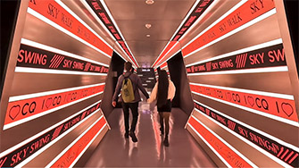

# Chongqing's First Impressions: Arrival Guide

## Overview

<Description>

<i>Name</i><b>Chongqing, Chungking</b>

<i>Climate</i><b>Subtropical moist monsoon climate</b>

<i>Nickname</i><b>Mountain City, Fog City, City of Bridges, River City, 8D Magic City</b>

<i>Temperature</i><b>30℃ - 48°C in summer</b>

<i>Area</i><b>82,402 km²</b>

<i>Population</i><b>32 million</b>

<i>Region</i><b>Southwest China</b>

<i>Location</i><b>Upper reaches of the Yangtze River, southwestern inland China</b>

<i>Attractions</i><b><a href="/chongqing/cityscape#hongyadong">Hongyadong</a>, <a href="/chongqing/dazu">Dazu Rock Carvings</a>, <a href="/chongqing/wulong">Wulong Karst Tourism Area</a>, <a href="/chongqing/three-gorges">Yangtze River Three Gorges</a>, Ciqikou Ancient Town, <a href="/chongqing/cityscape#the-two-rivers-tour">Yangtze River Cableway</a></b>

<i>Visa Strategy</i><b><a href="/guide/visa#_144-hour-transit-visa-exemption">144-Hour Transit Visa</a></b>

</Description>

<YouTube link="https://youtu.be/0kfhyOKM888?si=AzCMWcMNKhRYBnCb">
<template #cover></template>
<template #title>The Biggest City on Earth You've Never Heard Of</template>
<template #author>PPPeter</template>
<template #description>With population of 32,000,000, Chongqing, China is the biggest city on Earth. Its unbelievable area makes it also the largest city in the world.</template>
</YouTube>

## Features

Chongqing, which covers 82,300 square kilometers—twice the size of the Netherlands—and has a population exceeding 30 million, is one of the largest cities in the world.

- **Mountain Metropolis**: Surrounded by mountains, its architecture follows the nature topography, creating a unique '8D landscape' with buildings at varying elevations.
- **The Bridge City**: With its numerous rivers, it has constructed over 20,000 bridges to connect land and span valleys. The Legend says navigation doesn't work here.
- **Fog Capital**: Chongqing has a subtropical humid climate, characterized by high humidity and frequent fog. Especially during autumn and winter, thick mist often shrouds the city.
- **Hotpot Capital**: It is the birthplace of hotpot and has over 32,000 hotpot restaurants.

<YouTube link="https://youtu.be/D2RATbbd9DU?si=obU1QSqT3voZkypr&t=52">
<template #cover></template>
<template #title>Arriving in China! (Our First Impressions)</template>
<template #author>Jack Torr & Sophia</template>
</YouTube>

## Night View from Above

Chongqing's night views are incredibly famous. Should you happen to arrive in Chongqing at night, opting for a window seat on **the left side** of the aircraft gives you <u>a 50% chance (determined by wind direction) to witness the beautiful urban night scenery of Chongqing</u> just before the plane lands.

> The runway numbers at Chongqing Jiangbei International Airport are 02/20. Runway 02 is used for landings and takeoffs on a heading of north-east. The approach path for this runway happens to pass over the most beautifully lit urban area of Chongqing, presenting a stunning night view. Whether Runway 02 or Runway 20 is used for actual landings depends on the wind direction. Planes typically land into the wind, so when there is a southwest wind, there's a high probability that planes will be landing on Runway 02.

If you're fortunate enough, as the plane clears the final mountain and makes its last right-hand maneuver, you'll catch sight of the Chongqing urban area, with only a few minutes remaining until touchdown.

<YouTube link="https://youtu.be/wOh2wmvNfEU?si=r3OsrNRU0xajeQRJ&t=315">
<template #title>Magnificent night view of Chongqing, China</template>
<template #author>Wesley J.</template>
<template #description>Taken from the flight :)</template>
</YouTube>

## Yellow Taxis

<Flex>

Chongqing's taxis are famously painted in a uniform yellow color, which has led to their affectionate nickname as ‘Yellow Ferraris’ because of the drivers' skilled driving techniques.

For reference, it is approximately 25 kilometers from the airport to the city center, and a taxi ride takes about 1 hour with a fare of around <CNY>70</CNY>.

Payments via Alipay, WeChat, and cash will be accepted.

</Flex>

<YouTube link="https://youtu.be/rZb_P7xDVJo?si=K3LCgMCUFiqGQIXr&t=391">
<template #cover></template>
<template #title>Entering The LARGEST City in the WORLD (Chongqing, China)</template>
<template #author>KSquared</template>
<template #description>It took only five minutes to fill out the entry forms, and I couldn't wait to jump into a yellow taxi. The driver didn't need GPS, navigating through places that felt like underground parking lots...</template>
</YouTube>

::: info LOCAL TIPS
Do not trust those "overly enthusiastic" unlicensed taxi drivers; find a yellow taxi; always by meter.
:::

## Stays

You may choose to stay at a hotel in the city center, which is conveniently close to all the internet-famous attractions. A classic itinerary would be: start with a walk to Kuixinglou, marveling at Chongqing’s unique topography where what appears to be the first floor is actually the twentieth level; then, take Line 2 of the monorail to Liziba Station, to witness the extraordinary spectacle of the train passing right through a building.

<Map height="40vh" center="106.552003,29.562696" :zoom="13" driving="106.638691,29.717337,airport|106.577708,29.567822,Skyline Viewpoint|106.587897,29.565634,Raffles" points="106.578953,29.562165,Hongyadong|106.530586,29.550659,Liziba Monorail Piercing Building|106.587897,29.565634,Raffles|106.582809,29.557813,Yangtze River Cable Car|106.573579,29.559729,Kuixinglou"></Map>

Four-Star Hotels from <CNY>300</CNY> to <CNY>800</CNY>, Airbnb above <CNY>100</CNY>, and Hostel at <CNY>20</CNY>.

## Prices

Some basic food items in China, such as rice, noodles, and cooking oil, typically have lower prices. In European and American countries, the prices of meat and dairy products are often more reasonable.

Here are some price references for Chongqing: Cola 500ml for <CNY>3.5</CNY>, Mineral Water 5L for <CNY>8.5</CNY>, Beef 500g for <CNY>75</CNY> and Tomato 500g for <CNY>1.5</CNY>.

<YouTube link="https://youtu.be/6-5wmhpnT_k?si=EWA77ir71zaZr9sI">
<template #cover></template>
<template #title>Full Supermarket Tour in China (Shocking Prices)</template>
<template #author>Two Mad Explorers</template>
<template #description>Exploring a local supermarket in Chongqing, the prices were surprisingly cheap; We managed to buy everything We wanted for just 20 euros.</template>
</YouTube>
