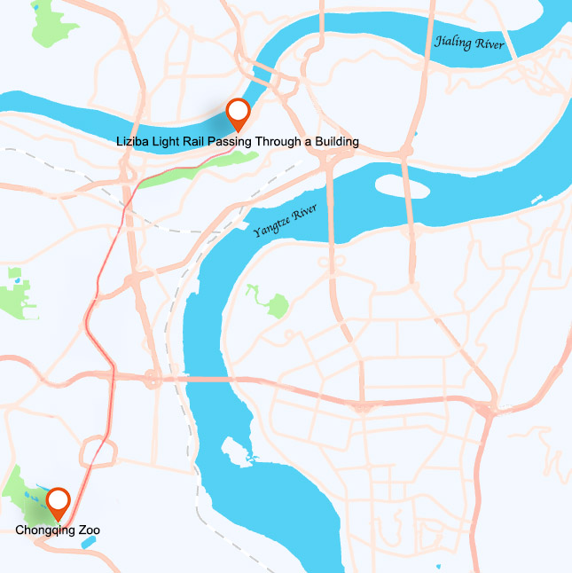

# Explore Chongqing Zoo: A Panda Encounter & Animals

## Chongqing Zoo

::: info LOCAL TIPS
Sure, Chengdu is essentially the best place to see pandas. However, if your schedule is tight, visiting the Chongqing Zoo is also a good option.
:::

<Description>

<i>Best Time to Visit</i><b>Daytime</b>

<i>Activities</i><b>Sightseeing</b>

<i>Crowd Level</i><b>Crowd</b>

<i>Ticket Price</i><b><CNY>25</CNY></b>

<i>Navigation</i><b><Navigation position="106.510211,29.501103" name="Chongqing Zoo" /></b>

</Description>

The zoo was opened to the public in January 1955. It covers an area of 43.5 hectares.

### Giant Pandas

<Chinese word="大熊猫">
<template #pinyin>dà xióng māo</template>
Giant Pandas
</Chinese>

Chongqing Zoo currently has more than 20 giant pandas, making it one of the zoos with the largest number of giant pandas in the country.

<YouTube link="https://youtu.be/ek8eN4VxbjA?si=5Z-5mYYauUDZOW4a&t=760">
<template #cover></template>
<template #title>Chongqing - CHINA'S MEGA CITY - YOU haven't heard of!</template>
<template #author>Joel Friend</template>
<template #description>We went to the zoo in this city and saw the national treasure animal of the country — the panda.</template>
</YouTube>

::: info LOCAL TIPS
You can take Line 2 of the monorail, the same line that goes through the Liziba station building, and it will take you directly to the zoo station.
:::

