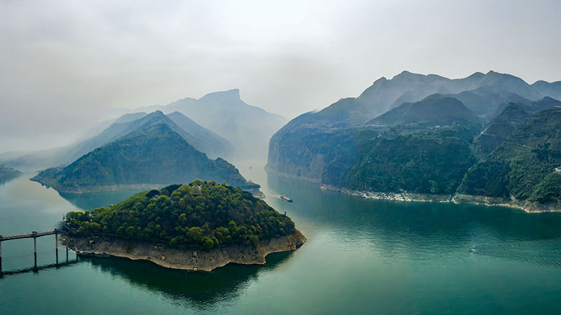

# Explore Three Gorges: Unveiling Ancient Culture

## The Three Gorges

The Three Gorges refers to the Qutang Gorge, Wu Gorge, and Xiling Gorge formed by the Yangtze River as it flows through central China. These three gorges are renowned for their rugged terrain and spectacular scenery.

## Kuimen

Kuimen is a section of the canyon at the entrance of Qutang Gorge, one of the Three Gorges along the Yangtze River. It is a famous landmark on the Yangtze, renowned for its precipitous and spectacular scenery. The cliffs on both sides of Kuimen rise sheer and tall, the river is narrow, and the current is swift. It is the shortest but most majestic section of the Three Gorges. Ancient scholars and poets often left behind poems and writings here to express their admiration for the natural wonders.

The pattern on the back of the ten-yuan Renminbi (RMB) note is Kuimen.

## Baidi City

Baidi City is situated on Baidi Mountain, not far from Kuimen; today, this mountain has become an island. It was an ancient military stronghold and is also a renowned scenic tourist area and source of literary inspiration.

The famous poet Li Bai, after being exiled in AD 755, wrote "Departing from White Emperor City Early in the Morning" upon receiving a pardon during his journey.

In 223 AD, after his defeat in the Battle of Yiling (also known as the Battle of Xiaoting), the Shu Han emperor Liu Bei retreated to it. While gravely ill there, he entrusted the state affairs and his son Liu Shan to Prime Minister Zhuge Liang, an event known as the "Entrustment at White Emperor City."

> Departing from Baidi City where clouds are tinged with dawn,
I reach Jiangling a thousand miles away in just a single day.
On both banks, the cries of apes cease not;
My light boat has already sped past myriad mountains.
