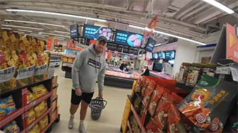

# Debunking Myths: How Safe is China for Traveling

## Health and Safety

China has seen significant development in recent years, with a notable improvement in the quality of its citizens. The country has made great strides in environmental hygiene and public safety.

<YouTube link="https://youtu.be/8A3Q-5fpaXI?si=91V4KT28MKJtwlUA">
<template #cover></template>
<template #title>How Safe is China as a foreigner in 2024?</template>
<template #author>Two Mad Explorers</template>
<template #description>We have been in China for a while now, but how safe have we felt? China is often demonised by the West as being very unsafe for foreigners.</template>
</YouTube>

## Fair Price

Some basic food items in China, such as rice, noodles, and cooking oil, typically have lower prices. In European and American countries, the prices of meat and dairy products are often more reasonable.

Here are some price references for Chongqing: Cola 500ml for <CNY>3.5</CNY>, Mineral Water 5L for <CNY>8.5</CNY>, Beef 500g for <CNY>75</CNY> and Tomato 500g for <CNY>1.5</CNY>.

<YouTube link="https://youtu.be/6-5wmhpnT_k?si=EWA77ir71zaZr9sI">
<template #cover></template>
<template #title>Full Supermarket Tour in China (Shocking Prices)</template>
<template #author>Two Mad Explorers</template>
<template #description>Exploring a local supermarket in Chongqing, the prices were surprisingly cheap; We managed to buy everything We wanted for just 20 euros.</template>
</YouTube>

In formal business establishments, merchants generally offer fair prices. However, be wary of unlicensed taxi drivers and try to choose licensed taxis instead.

<YouTube link="https://youtu.be/grWAN8GEJ-I?si=-9PqXF4IWr59AoU9">
<template #cover></template>
<template #title>CHINA: Supermarket Tour 2024 (SHOCKING PRICES) </template>
<template #author>KSquared</template>
<template #description>I went to a supermarket in Chongqing, China. I was shocked to see how affordable many of the items were.</template>
</YouTube>