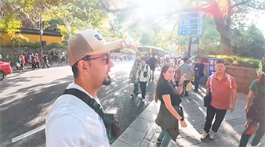

# Best Seasons to Visit China: How to Avoiding Crowds

## High Seasons

Tourist high seasons in China include the following periods:

- **Summer Vacation (July to August)**: This is a peak period due to school holidays, with many families and students traveling.
- **Spring Season (April to mid-May)**: During spring, flowers bloom, making it a popular time for flower viewing and outdoor activities.

## Peak Seasons

If you want to avoid the peak travel season with 1.8 billion trips, you should steer clear of the following periods when traveling to China.

| Periods                                   | Specific Date                |
| :---------------------------------------- | :--------------------------- |
| **Tomb Sweeping Day (Qingming Festival)** | Apr. 4, 2025 – Apr. 6, 2025  |
| **May Day (Labor Day)**                   | May. 1, 2025 – May. 7, 2025  |
| **Dragon Boat Festival**                  | May. 30, 2025 – Jun. 1, 2025 |
| **Mid-Autumn Festival and National Day**  | Oct. 1, 2024 – Oct. 7, 2024  |

During the peak travel season, it can be very difficult to make reservations for accommodations, transportation, and attractions. In popular tourist areas, due to the high number of visitors, there may be traffic controls implemented, which can make traveling by road quite inconvenient.

::: info LOCAL TIPS
During holidays such as the Spring Festival and National Day, the number of domestic trips in China exceeds 500 million.
:::

<YouTube link="https://youtu.be/2Kg8WGjb0-Q?si=4A8zi_pA_eT1icBS">
<template #cover></template>
<template #title>We SURVIVED CHINA'S PEOPLE MOUNTAIN PEOPLE SEA! 🇨🇳 (WORLD'S MOST MASSIVE CROWDS)</template>
<template #author>Sun Kissed Bucket List</template>
<template #description></template>
</YouTube>

## Best Seasons

China is vast, and the best travel seasons for different regions can be completely different.
China's spring season is from March to May, and the autumn season is from September to November.

| Hot Spots                            | Destinations          | Best Seasons    |
| :----------------------------------- | :-------------------- | :-------------- |
| Coastal Cities                       | Qingdao and Dalian    | July            |
| Scenic Mountain and Water Landscapes | Enshi, Hubei          | August          |
| Scenic Mountain and Water Landscapes | Tibet                 | August          |
| Scenic Mountain and Water Landscapes | Xinjiang              | September       |
| Scenic Mountain and Water Landscapes | Dunhuang              | October         |
| City Tourism                         | Hong Kong             | December        |
| City Tourism                         | Beijing               | April & Autumn  |
| City Tourism                         | Chongqing and Chengdu | April & Autumn  |
| City Tourism                         | Shanghai and Hangzhou | April & Autumn  |
| City Tourism                         | Guangzhou, Guangdong  | Autumn & Winter |
| City Tourism                         | Haerbin               | Winter          |
| Historical Sites                     | The Great Wall        | Year-round      |
| Historical Sites                     | The Forbidden City    | Year-round      |
