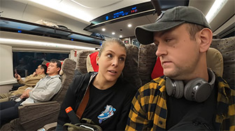

# HighSpeed Train: China's Advanced Railway Travel

China's railway system is highly advanced and can be categorized into several types:

| Type                                                                   | Speed    |
| :--------------------------------------------------------------------- | :------- |
| **High-Speed Rail (G-train)**                                          | 250 km/h |
| **Electric Multiple Units (D-train)**                                  | 200 km/h |
| Intercity Trains (C-train)                                             | 200 km/h |
| Rapid Trains (K-train)                                                 | 120 km/h |
| Express Trains (T-train) and Direct Express Trains (Z-train)           | 160 km/h |
| Ordinary Fast Trains (P-train) and Ordinary Passenger Trains (L-train) | 120 km/h |

<YouTube link="https://youtu.be/1Yger7RaOsE?si=PtqOwSdLDp8AOdiq">
<template #cover></template>
<template #title>China's Trains are INCREDIBLE</template>
<template #author>Two Mad Explorers</template>
<template #description>China's High speed rail network is largest railway system on earth. Today, we take an incredibly fast bullet train from Chengdu to Chongqing, China. </template>
</YouTube>

More than 12,000 trains operate daily in China, among which over a thousand are high-speed trains and electric multiple units. Smoking is strictly prohibited throughout the journey, and passengers are encouraged to maintain a quiet and clean carriage environment. These trains can deliver you to your destination smoothly and quickly.

### Seating Classes

For High Speed Trains (G-train and D-train):

| Class          | Description                                                       |
| :------------- | :---------------------------------------------------------------- |
| Business Class | The highest class, fully reclining seats, priority boarding       |
| First Class    | 4 seats per row (2+2), Greater space and comfort |
| Second Class   | 5 seats per row (3+2)                            |

For other trains, there is also:

| Class          | Description                                                       |
| :------------- | :---------------------------------------------------------------- |
| Soft Sleeper | Cabins available, each with 4 berths       |
| Hard Sleeper | Divided into compartments, each with 6 berths |
| Hard Seat    | Usually 5 seats per row (3+2) |       

<YouTube link="https://youtu.be/WbAKvKXT95A?si=2_k2E1tWwO1xduCS">
<template #cover></template>
<template #title>Riding the WORLD'S FASTEST Bullet Train From Beijing to Shanghai</template>
<template #author>Jay and Karolina</template>
<template #description></template>
</YouTube>

## Meal On Train

### Dining Car

The train has a dining car that offers boxed meals, fast food, and snacks.

### Ordering Delivery

You might want to try ordering delivery while on the train.

Log in to the 12306 official website or use the 12306 App. On the order details page, there is usually an option to order meals. You need to select the station and meal you want to order from. The food will be brought onto the train at that station and delivered to your seat.

Please note that meal ordering is not available at all stations, and you need to place your order before the train arrives at the station. The choice of vendors is limited, but options such as McDonald's and KFC are included.

::: info LOCAL TIPS
You should plan your meal orders ahead of time. You can check the arrival times at each station in your order details and identify the stations that support ordering and are reached around your mealtime, then make your reservations in advance.
:::

## Booking Online

You can purchase train tickets with cash at the station, but it is more recommended to book them online using an app, which is more convenient.

::: info LOCAL TIPS
Chinese trains have a very high punctuality rate; it is recommended to arrive at the station 30 minutes before departure.
:::

::: info LOCAL TIPS
You can book tickets up to 15 days in advance. Tickets for holidays such as the Spring Festival and National Day are very tight, and it may not be possible to secure them even if you book 15 days ahead. Please try to avoid traveling during these periods if possible.
:::

### 12306

<svg viewBox="0 0 1024 1024" version="1.1" xmlns="http://www.w3.org/2000/svg" width="30" height="30"><path d="M911.40096 274.67776C847.872 164.43392 741.34528 84.08064 616.16128 56.05376c-3.72736-1.86368-7.4752-5.60128-7.4752-9.33888-1.86368-18.688-13.07648-35.51232-29.88032-42.97728h-1.88416C554.48576 1.86368 533.94432 0 511.52896 0c-20.56192 0-42.97728 1.86368-67.2768 5.60128-16.81408 7.4752-28.02688 24.28928-29.9008 42.97728 0 3.72736-3.7376 9.33888-7.4752 9.33888-113.98144 26.1632-211.1488 95.30368-276.55168 192.47104-67.2768 100.90496-91.56608 222.3616-67.2768 341.95456 26.1632 128.94208 108.38016 241.05984 224.23552 304.5888h3.74784c1.86368 0 3.72736-1.88416 5.60128-1.88416l63.52896-82.21696c1.87392-1.86368 1.87392-3.72736 1.87392-5.60128a4.02432 4.02432 0 0 0-3.7376-3.7376c-80.35328-41.1136-142.00832-110.2336-170.0352-196.1984-28.03712-85.95456-20.55168-177.5104 20.54144-257.86368 57.92768-113.99168 173.78304-184.99584 302.72512-184.99584a331.6736 331.6736 0 0 1 153.21088 37.36576c168.18176 84.09088 233.58464 287.78496 149.504 454.08256-33.6384 63.52896-84.09088 115.84512-149.504 147.6096-1.86368 1.88416-3.72736 1.88416-3.72736 3.7376 0 1.87392 0 3.7376 1.87392 5.60128l63.52896 82.21696c1.88416 1.88416 3.7376 1.88416 5.61152 1.88416s1.87392 0 3.72736-1.88416C842.26048 835.26656 918.87616 738.0992 952.5248 620.38016c33.62816-117.72928 18.688-239.18592-41.12384-345.7024z" fill="#E81A1A"></path><path d="M780.5952 956.71296L590.00832 919.3472c-26.17344-5.60128-44.86144-28.02688-44.86144-54.19008V611.03104c0-16.82432 11.22304-31.76448 28.02688-35.50208l89.7024-24.28928c3.71712 0 5.60128-3.74784 5.60128-5.62176v-84.0704c0-24.29952-13.07648-46.72512-33.61792-59.8016h-1.88416c-44.84096-7.4752-87.82848-11.2128-130.79552-11.2128-42.97728 0-85.95456 3.72736-127.05792 9.33888h-1.87392c-20.55168 13.07648-33.6384 35.50208-33.6384 59.8016v84.08064c0 3.72736 1.87392 5.61152 5.61152 5.61152l89.69216 24.28928c16.81408 3.72736 28.03712 18.67776 28.03712 35.50208v252.2624c0 26.17344-18.688 48.57856-44.8512 54.20032l-190.59712 37.36576c-11.20256 1.86368-20.55168 13.06624-20.55168 24.27904v39.24992c0 3.74784 3.7376 7.4752 7.4752 7.4752h584.86784c3.7376 0 7.46496-3.72736 7.46496-7.4752v-39.24992c-5.61152-9.32864-13.07648-18.67776-26.1632-20.55168z" fill="#E81A1A"></path></svg>

[12306.cn](https://www.12306.cn/en/index.html)

12306 is the official website and app of China Railway Customer Service Center, primarily used for booking train tickets.

- Real-name ticketing
- Only valid foreign passports useable according to related regulations are accepted
- Both E-tickets and paper tickets are on sale
- Online payment

### Trip.com

[trip.com](https://trip.com/trains/china)
