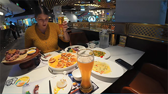

# China Qingdao Seafood: Flavors from the Yellow Sea

Qingdao, as a coastal city, boasts a rich variety of seafood resources that are closely tied to the natural environment.

**Spring (March to May)**
- **Mackerel**: Spring is when mackerel is at its most delicious, with excellent meat quality, making it one of the main seafoods during this season.
- **Prawns**: Starting from spring, especially after the Qingming Festival, prawns become widely available.

**Autumn (September to November)**
- **Crabs**: Particularly around mid-August, crabs are at their most plump and tasty, making it the best time to enjoy them.

::: info LOCAL TIPS
During summer, due to the fishing moratorium implemented in the Qingdao sea area, the supply of freshly caught seafood may decrease for part of the season.
:::

<YouTube link="https://youtu.be/vY2x2kXZ_hE?si=IBpVbtPVdv0w_WkR">
<template #cover></template>
<template #title>This is SEAFOOD HEAVEN in Qingdao, China</template>
<template #author>Two Mad Explorers</template>
<template #description>We came to Qingdao, China for this. We are enjoying some real Qingdao seafood and German pork knuckle at the Tsingtao flagship store.</template>
</YouTube>