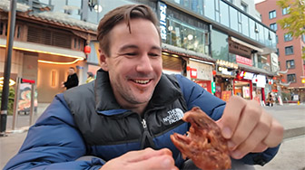

# Taste of Chengdu: Local Specialties, Must-Try

## Shuangliu Rabbit Head

<Chinese word="双流兔头">
<template #pinyin>shuāng liú tù tóu</template>
Shuangliu Rabbit Head
</Chinese>

<Description>

<i>Type</i><b>Snack</b>

<i>Ingredients</i><b>Rabbit Head</b>

<i>Flavor</i><b>Very Spicy</b>

<i>Price</i><b><CNY>15</CNY></b>

<i>Vegetarian</i><b>No</b>

<i>Note</i><b>-</b>

<i>Recommendation</i><b>Recommended</b>

<i>Dining Duration</i><b>Minutes</b>

<i>Dining Method</i><b>Dine-in, Take-away</b>

<i>Commonness</i><b>Rare</b>

</Description>

The rabbit head is usually split in half to better absorb the flavors, then marinated with spices such as chili peppers and Sichuan peppercorns, and cooked using methods such as boiling or braising, resulting in a delicious and spicy flavor. For first-time tasters, it may require some adaptation.

<YouTube link="https://youtu.be/JyV6HgPoaUw?si=Pr5ulLDesAjO6vxf&t=308">
<template #cover></template>
<template #title>Wangping Street Eats, Chengdu Sichuan China 🇨🇳</template>
<template #author>Wilko Wanders</template>
<template #description>A walk to Wangping street for some awesome Sichuan food, yes, that's a rabbit head in the thumbnail, they eyes go pop when you suck them out! I also hit up a century egg dish with eggplant and peppers, a beef dish called ...</template>
</YouTube>
