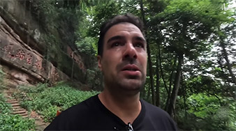

# Sichuan Qingcheng Mountain: Daoist Holy Site

<Chinese word="青城山">
<template #pinyin>qīng chéng shān</template>
Qingcheng Mountain
</Chinese>

<Description>

<i>Best Time to Visit</i><b>Daytime</b>

<i>Activities</i><b>Sightseeing</b>

<i>Crowd Level</i><b>Quiet</b>

<i>Ticket Price</i><b><CNY>80</CNY> to <CNY>180</CNY></b>

<i>Recommendation</i><b>Recommended</b>

</Description>

Qingcheng Mountain is located in the southwestern part of Dujiangyan City, Sichuan Province. It is one of China's famous Daoist holy sites and also a UNESCO World Cultural and Natural Heritage site. Qingcheng Mountain is one of the birthplaces of Daoism, with over 1,800 years of Daoist history.

<YouTube link="https://youtu.be/mHIX3n7CQAU?si=U7CYL17-bbcouCBu">
<template #cover></template>
<template #title>I CAME TO CHINA FOR THIS! 🇨🇳☯🙏 Mount Qingcheng: the birthplace of Taoism</template>
<template #author>Ride with Gabi</template>
<template #description>One of the main reasons why I decided to come to China, was to visit Mount Qingcheng: the birthplace of Taoism.</template>
</YouTube>