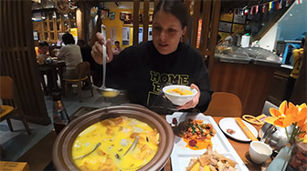

# Mushroom Hot Pot That's Truly 'Intoxicating'

## Mushroom Hot Pot

Mushroom Hot Pot is a specialty dish originating from the Yunnan region of China, featuring a wide variety of wild mushrooms as its primary ingredients. A selection of different mushrooms, such as matsutake, porcini, chicken-of-the-woods, and bamboo fungus, are sliced or kept whole and cooked in a clear broth or specially prepared soup base.

In Yunnan, where there is a rich diversity of wild mushrooms, the Mushroom Hot Pot is a beloved culinary delight. However, some wild mushrooms contain toxins that can lead to mushroom poisoning if they are not correctly identified or prepared. One form of mild poisoning is sometimes referred to as the "little people" effect because certain toxins can induce hallucinations, causing people to see visions of elves or "little people."

<YouTube link="https://youtu.be/DCWZirRWGUo?si=LOcivksEYN9lAg-x">
<template #cover></template>
<template #title>MAGIC MUSHROOM HOTPOT in Yunnan, China</template>
<template #author>Two Mad Explorers</template>
<template #description>We had to try the wild mushroom hotpot of Yunnan, China.</template>
</YouTube>

::: info LOCAL TIPS
Mushrooms in Yunnan are diverse and can be difficult to identify; every year, there are cases of people poisoning themselves by eating mushrooms. It is essential to consume mushrooms under the guidance of local experts, and the mushrooms must be thoroughly cooked.
:::