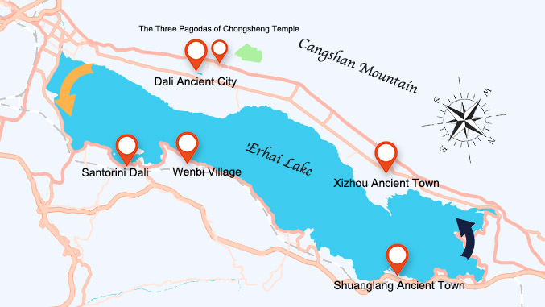

# Circling Erhai Lake & Its Ancient Towns by Vehicle

## Erhai Lake

Despite the word "hai" implying an ocean in Chinese, Erhai is actually a freshwater lake covering an area of approximately 250 square kilometers. It is the seventh-largest freshwater lake in China, named after its shape which resembles a human ear.

There are numerous attractions around the lake, including islands that can be explored by boat and hills suitable for hiking. Additionally, Erhai serves as a habitat for many bird species, attracting birdwatchers.

<YouTube link="https://youtu.be/GwvCzAqXX5k?si=AZ8osxXme2zTuNud&t=617">
<template #cover></template>
<template #title>BEST DAY IN DALI, YUNNAN We Couldn’t Wait To Come Here In China!</template>
<template #author>Flora and Note</template>
<template #description>We explore the charming Shuanglang Ancient Town, indulge in delicious rose cakes and Yunnan coffee, and uncover the countless picture-perfect spots around the Erhai Lake.</template>
</YouTube>

::: info LOCAL TIPS
To the south of Erhai is the new urban district, which is also where the train station is located. To the west of Erhai is the old town area, where most of the major attractions are concentrated, including [Dali Ancient City](/yunnan/dali/erhai#dali-ancient-city), [the Three Pagodas of Chongsheng Temple](/yunnan/dali/erhai#the-three-pagodas-of-chongsheng-temple) and [Xizhou Ancient Town](/yunnan/dali/erhai#xizhou-ancient-town). The east side of Erhai has [Shuanglang Ancient Town](/yunnan/dali/erhai#shuanglang-ancient-town), as well as a beautiful coastal road that runs along the lake, making it very suitable for driving around the lake by car.
:::

<YouTube link="https://youtu.be/_Ij1m42vL28?si=f0gpuCC5E4dscGRe&t=154">
<template #cover></template>
<template #title>Why Chinese Dali So Attractive?</template>
<template #author>英国贝丝</template>
<template #description>My British girlfriend said, 'The winter in Dali is so beautiful; I really want to settle here!'</template>
</YouTube>

::: info LOCAL TIPS
You can visit the Longkan Ancient Ferry to enjoy Erhai Lake, and then take a sightseeing electric cart or rent an electric scooter to travel along the western shore of Erhai Lake to Xi Zhou Ancient Town. The journey is approximately 20 kilometers long.
:::

<YouTube link="https://youtu.be/27JJX0ZnH9U?si=LpCVUJRCuiVBI_vR&t=1111">
<template #cover></template>
<template #title>WE GOT LOST in Dali</template>
<template #author>Sun Kissed Bucket List</template>
<template #description>Exploring the countryside of Rural China had always been a dream of ours. To be able to ride around in the lush green valleys and explore the villages.</template>
</YouTube>

::: info LOCAL TIPS
Driving around Erhai covers a distance of approximately 150 kilometers. Including stops for sightseeing, the journey typically requires a full day. You can set your navigation route as follows: Start counterclockwise from **Dali Ancient City, heading to Santorini Dali, then Wenbi Village, followed by Shuanglang Ancient Town (with a stop for lunch), then Xizhou Ancient Town, and finally back to Dali Ancient City**.
:::

::: info LOCAL TIPS
The train to Lijiang will also pass through this route. If you plan to take the train from Dali to Lijiang, remember to get a seat on the left side.
:::

## Dali Ancient City

The history of Dali Ancient City can be traced back to the Nanzhao Kingdom, which was established in the early 8th century. Dali became a significant political center during the rule of the Duan family under the Dali Kingdom (937 to 1253), when it reached its peak. The current incarnation of Dali Old Town began its construction during the Hongwu period of the Ming Dynasty, around 1382 AD. Thus, if counted from the Ming Dynasty reconstruction, Dali Old Town has a history of over 600 years.

<YouTube link="https://youtu.be/Anb9z7lzW7M?si=usReEzTaniMwVPEA&t=501">
<template #cover></template>
<template #title>Dali Ancient City, Yunnan - One of China's oldest towns</template>
<template #author>Wilko Wanders</template>
<template #description>My first train journey in China, travelling from Kunming to Dali, one of the oldest villages in the country. I’ll be staying in Dali Old Town on a friend’s recommendation. I am excited to explore all that this historic area has to offer.</template>
</YouTube>

<YouTube link="https://youtu.be/kcjOZ7lg770?si=2tmVDxaa6xNEYFuu&t=481">
<template #cover></template>
<template #title>Incredible First Impressions of Dali, Yunnan, China</template>
<template #author>Two Mad Explorers</template>
<template #description>It's our very first day in Dali and we can honestly say that we have fallen in love with this city. China never ceases to amaze us when it comes to hospitality, food and amazing scenery.</template>
</YouTube>

## the Three Pagodas of Chongsheng Temple

The Three Pagodas of Chongsheng Temple is a group of Buddhist structures includes the main Qianxun Pagoda and the smaller Northern and Southern Pagodas. The Qianxun Pagoda is the tallest among them, standing at 69.13 meters high, built between 833 and 840 AD during the Tang Dynasty. The smaller pagodas were constructed slightly later, probably in the late 9th to early 10th centuries.

Beyond being a landmark in the Dali region, the Three Pagodas hold significant status within Buddhist history. They symbolize the flourishing of Buddhism during the periods of the Nanzhao and Dali Kingdoms, serving as one of the centers for Buddhist activities in the area. The existence of the Three Pagodas reflects the profound influence of Buddhism on local social life and provides valuable references for studying Buddhist art and architectural styles of the era.

<YouTube link="https://youtu.be/Dk9D7jeWbLg?si=wh76wuAG3SKZaq0t&t=946">
<template #cover></template>
<template #title>We Never Expected Rural China to Look Like This</template>
<template #author>Two Mad Explorers</template>
<template #description>These areas of China are what we appreciate the most!</template>
</YouTube>

## Xizhou Ancient Town

Xizhou Ancient Town is situated west of Erhai Lake, backed by the Cangshan Mountains. Its history dates back to the Song Dynasty, and it preserves well-maintained traditional Bai ethnic architecture and a strong cultural atmosphere.

<YouTube link="https://youtu.be/dzr2kWiPxr8?si=NrbQKyEOgGe2a_Sp&t=117">
<template #cover></template>
<template #title>Electric Bike Adventure in Dali, China</template>
<template #author>Two Mad Explorers</template>
<template #description>It's our very first day in Dali and we can honestly say that we have fallen in love with this city. China never ceases to amaze us when it comes to hospitality, food and amazing scenery.</template>
</YouTube>

<YouTube link="https://youtu.be/fSQteeMziYw?si=pfpL6CyNq_MhkRF4">
<template #cover></template>
<template #title>Why RURAL CHINA is More Incredible Than YOU Think... 🇨🇳</template>
<template #author>Sun Kissed Bucket List</template>
<template #description>From ancient villages and stunning rice terraces to the vibrant culture of the Bai people, we went on an unforgettable journey through this beautiful country side of China, specifically from Dali in Yunnan province.</template>
</YouTube>

## Shuanglang Ancient Town

Shuanglang Ancient Town is located on the northeast shore of Erhai Lake and is renowned for being surrounded by mountains on three sides and facing Erhai Lake on the other, earning it the accolade of being the "First Scenic Town of Cang-Er Region."