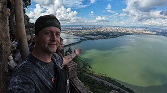

# Explore Kunming: The Spring City of Yunnan

## Dianchi Lake

Dianchi Lake, also known as Kunming Lake, is a large lake located near the city. It is the largest lake in Yunnan Province and the sixth-largest freshwater lake in China. Situated at an altitude of approximately 1,886 meters, the lake covers an area of about 330 square kilometers and has a slightly crescent shape, earning it the "Pearl of the Plateau."

Every winter, thousands of seagulls fly from the distant regions of Siberia to spend the winter at Dianchi Lake. These seagulls typically begin arriving at here from late October to early November and remain there until the end of March or early April of the following year. People feed these seagulls at locations around the lake and also at Cuihu Park within the city.

## Cuihu Park

The seagulls generally roost overnight in Cuihu Park.

<YouTube link="https://youtu.be/4NXieWrJLKM?si=TanaHwOKEAvgFwKf&t=1104">
<template #cover></template>
<template #title>China is Collapsing? We Don't Think so...</template>
<template #author>Two Mad Explorers</template>
<template #description>We receive messages and comments every day about how "China is falling apart" or "China is collapsing" but we find that the more we explore China, the more we find that this is simply not the truth.</template>
</YouTube>

## Western Hills

::: info LOCAL TIPS
Because there are many people feeding the seagulls, the best time for the experience may be in the morning. You can take the cable car up to the Western Hills after feeding the seagulls.
:::

Taking the cable car allows visitors to enjoy panoramic views of Dianchi Lake and the city of Kunming, providing a unique perspective of the landscape.

<YouTube link="https://youtu.be/4NXieWrJLKM?si=TanaHwOKEAvgFwKf&t=1104">
<template #cover></template>
<template #title>We Can't Believe THIS is Kunming China</template>
<template #author>Two Mad Explorers</template>
<template #description>Today, we are exploring the western mountains of Kunming city. Yunnan has some incredible scenery and Xishan in Kunming is certainly no exception.</template>
</YouTube>
