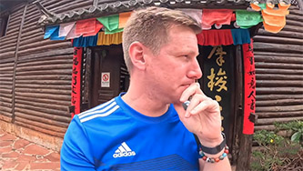

# Diversity in Kunming: Minority Cultures

## Kunming Ethnic Village

Kunming Ethnic Villages is a large theme park that showcases the social and cultural traditions of 25 ethnic minorities in Yunnan Province. Each ethnic group has its own village, such as the bamboo stilt houses of the Dai people, the three-room compound with a screen wall of the Bai people, and the earth-palm houses of the Yi people. These villages are built according to the traditional styles of each ethnic group and strive to maintain their original appearance. In addition, the Ethnic Villages regularly host various ethnic festivals, such as the Water Splashing Festival and the Torch Festival, allowing visitors to experience the rich and diverse ethnic cultures firsthand.

<YouTube link="https://youtu.be/1Yger7RaOsE?si=PtqOwSdLDp8AOdiq">
<template #cover></template>
<template #title>Why Kunming Made Me Cry Heartfelt Travel Vlog</template>
<template #author>Wilko Wanders</template>
<template #description>Yunnan Ethnic Minorities Village in Kunming. Where I met 11 minority tribes people who live in this province of China. I was blown away with the kindness and welcoming nature of everyone.</template>
</YouTube>

::: info LOCAL TIPS
The Ethnic Villages are located near Dianchi Lake, and you can visit both in one trip. You can also take a cable car up to the Western Hills for sightseeing.
:::