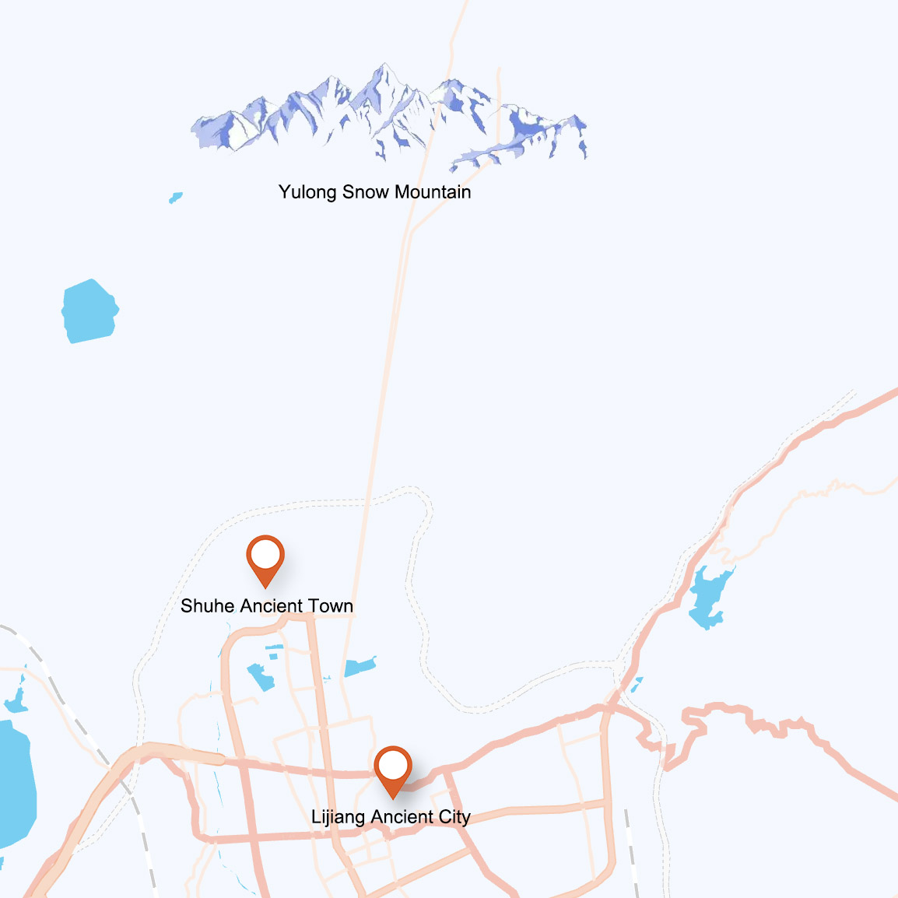
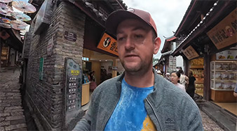
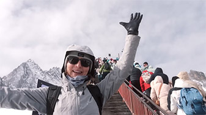

# Lijiang: Ancient Cities Beside the Snow Mountain

## Lijiang Ancient City

Lijiang Ancient City is a well-preserved minority ancient town and is recognized as a UNESCO World Heritage site. The history of the ancient city dates back to the Song and Yuan dynasties, with a history spanning over 800 years. Its distinctive features include unique architectural styles and an intricate network of waterways. Most of the buildings here retain the style of the Ming and Qing dynasties, primarily constructed with wooden structures. The water channels within the ancient city originate from the melted snow waters of Yulong Snow Mountain, flowing through every corner of the ancient town.

<YouTube link="https://youtu.be/UI5kl3ynt_k?si=Mwt4-jG_nKwsnur3&t=69">
<template #cover></template>
<template #title>Chinese Hospitality Left us Speechless</template>
<template #author>Two Mad Explorers</template>
<template #description>Today we are exploring the real Lijiang in Yunnan. We meet some incredibly friendly locals and have a good laugh with them.</template>
</YouTube>

<YouTube link="https://youtu.be/aZTqN-jM2Iw?si=poiEh1VXmFoIxD-4">
<template #cover></template>
<template #title>Beyond The Trip - Viaggio a Tempo Indeterminato</template>
<template #author>Two Mad Explorers</template>
<template #description>Ci sono molti stereotipi sulla Cina e sui suoi abitanti. Oggi andiamo a vedere se quelli più comuni sono veri o falsi. E mentre facciamo queste ricerche, rimaniamo sconvolti da Lijiang e da quello che vediamo.</template>
</YouTube>

#### The Bonfire Party

The bonfire party in Lijiang's Si Fang Street is an event full of the local Naxi ethnic flavor, typically held on rain-free nights. Visitors can participate in dancing around the bonfire, experiencing the traditional Naxi dances, which is also a great opportunity to learn about the local culture. The bonfire party usually takes place between 7:00 PM and 8:30 PM, with a large gathering of tourists and locals coming together to celebrate.

<YouTube link="https://youtu.be/I-qrZymMzoo?si=Wwhk63wI8F8pC64p">
<template #title>Bonfire Hit Jump Dance Party of Dali March Street Ethnic Festival, Yunnan, China</template>
<template #author>Chao's Travel Log 超思旅行日志</template>
<template #description>Bonfire Hit Jump Dance Party
Dali March Street Ethnic Festival</template>
</YouTube>

::: info LOCAL TIPS
The 'Si Fang' in 'Si Fang Street' refers to the east, south, west, and north. Therefore, Si Fang Street can be understood as a central, well-connected public place located right at the heart of the ancient city. If you ever get lost, try following the sounds of music in the evening to find it.
:::

#### Dongba Script

You can see an ancient pictographic script in Lijiang Ancient City, known as Dongba script. Dongba script is primarily used for religious texts, historical records, and folk literary works, written and interpreted by Dongba priests. Dongba priests are religious and cultural leaders in the Naxi society, responsible for preserving these documents and using them in religious ceremonies.

<YouTube link="https://youtu.be/bPcIqGPF5Kg?si=UQZKvbGBk0wSSt2d">
<template #cover></template>
<template #title>اكتشفت مكان ماتتوقعه بالصين ! - Lijiang</template>
<template #author>Ahmed Alshammari</template>
<template #description></template>
</YouTube>

## Shuhe Ancient Town

Shuhe Ancient Town is located to the north of Lijiang's Old Town, closer to the Yulong Snow Mountain. It is a small market town near Lijiang's Old Town with a history spanning over a thousand years. Shuhe boasts cultural landscapes that are as well-preserved as those in Lijiang's Old Town, but it receives fewer tourists.

Staying here is great for relaxing your mind. Especially enjoyable is appreciating the sunrise over the Golden Mountain from the rooftop, or wandering around the ancient town after dark when most of the tourists have dispersed.

## Yulong Snow Mountain

Yulong Snow Mountain, also known as Jade Dragon Snow Mountain, is a renowned natural landmark in the region Composed of 13 peaks, the highest of which, Shanzidou, reaches an altitude of 5,596 meters and is perpetually covered in snow. Yulong Snow Mountain is not only famous for its majestic natural beauty but is also considered a sacred place by the Naxi people.

::: info LOCAL TIPS
It is just to the north of the ancient city, visible from there; if you wake up a bit earlier and find a rooftop balcony or a better spot between 6:30-7:00, you’ll have the chance to see the magnificent sight of the sun illuminating the golden mountains.
:::

<YouTube link="https://youtu.be/MPw4SaS-C-M?si=0aht8SZ4ZBQzZLe7&t=169">
<template #cover></template>
<template #title>AMERICANS IN CHINA (not what we expected)</template>
<template #author>Gone with the Wynns</template>
<template #description>China is not all what we expected and trust me, as a couple of Americans, we certainly had some reservations about trekking through the country without a real plan. </template>
</YouTube>

<YouTube link="https://youtu.be/GzcvGQoOilE?si=KC3my4Wv-YYyGZDS">
<template #cover></template>
<template #title>You need oxygen canisters to breathe here! - Dragon Snow Mountain Lijiang</template>
<template #author>Wilko Wanders</template>
<template #description>I climb to the highest peak of my life, (4,680 metres / 15,354 feet above sea level). It's a pretty fast climb too (There may be a cable car involved). As you ascend so quickly you need oxygen canisters to help you avoid altitude sickness! </template>
</YouTube>
