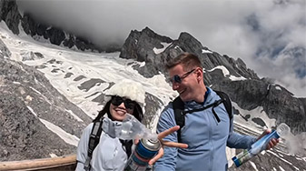

# Lijiang Ancient City Beside the Snow Mountain

## Lijiang Ancient City

The history of Dali Ancient City can be traced back to the Nanzhao Kingdom, which was established in the early 8th century. Dali became a significant political center during the rule of the Duan family under the Dali Kingdom (937 to 1253), when it reached its peak. The current incarnation of Dali Old Town began its construction during the Hongwu period of the Ming Dynasty, around 1382 AD. Thus, if counted from the Ming Dynasty reconstruction, Dali Old Town has a history of over 600 years.

<YouTube link="https://youtu.be/UI5kl3ynt_k?si=Mwt4-jG_nKwsnur3&t=69">
<template #cover></template>
<template #title>Chinese Hospitality Left us Speechless</template>
<template #author>Two Mad Explorers</template>
<template #description>Today we are exploring the real Lijiang in Yunnan. We meet some incredibly friendly locals and have a good laugh with them.</template>
</YouTube>

### The bonfire party

The bonfire party in Lijiang's Si Fang Street is an event full of the local Naxi ethnic flavor, typically held on rain-free nights. Visitors can participate in dancing around the bonfire, experiencing the traditional Naxi dances, which is also a great opportunity to learn about the local culture. The bonfire party usually takes place between 7:00 PM and 8:30 PM, with a large gathering of tourists and locals coming together to celebrate.

::: info LOCAL TIPS
The 'Si Fang' in 'Si Fang Street' refers to the east, south, west, and north. Therefore, Si Fang Street can be understood as a central, well-connected public place located right at the heart of the ancient city. If you ever get lost, try following the sounds of music in the evening to find it.
:::

## Yulong Snow Mountain

Yulong Snow Mountain, also known as Jade Dragon Snow Mountain, is a renowned natural landmark in the region Composed of 13 peaks, the highest of which, Shanzidou, reaches an altitude of 5,596 meters and is perpetually covered in snow. Yulong Snow Mountain is not only famous for its majestic natural beauty but is also considered a sacred place by the Naxi people.

::: info LOCAL TIPS
It is just to the north of the ancient city, visible from there; if you wake up a bit earlier and find a rooftop balcony or a better spot between 6:30-7:00, you’ll have the chance to see the magnificent sight of the sun illuminating the golden mountains.
:::

<YouTube link="https://youtu.be/GzcvGQoOilE?si=KC3my4Wv-YYyGZDS">
<template #cover></template>
<template #title>You need oxygen canisters to breathe here! - Dragon Snow Mountain Lijiang</template>
<template #author>Wilko Wanders</template>
<template #description>I climb to the highest peak of my life, (4,680 metres / 15,354 feet above sea level)
It's a pretty fast climb too (There may be a cable car involved) 
As you ascend so quickly you need oxygen canisters to help you avoid altitude sickness! </template>
</YouTube>