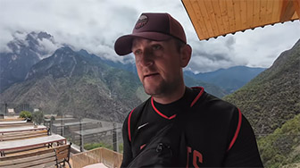
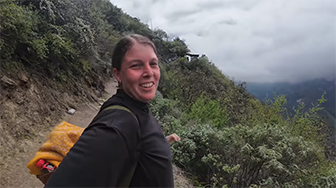

# Lijiang: Discovering The Mysterious Land of Daughters

## Lake Lugu

Lugu Lake is a beautiful and mysterious place, known as the 'Pearl of the Plateau.' The lake covers an area of 48 square kilometers and has an elevation of approximately 2,690 meters, making it one of China's deepest high-altitude freshwater lakes. The Mosuo people, a minority ethnic group living around Lugu Lake, still maintain a unique matrilineal social structure and a visiting marriage custom.

## Tiger Leaping Gorge

Tiger Leaping Gorge is one of the deepest gorges in the world, known for its spectacular natural beauty. he gorge is named after a legend that tells of a tiger leaping across the river at this point. Tiger Leaping Gorge sits above the Jinsha River (part of the upper Yangtze River) between Yulong Snow Mountain and Haba Snow Mountain.

The gorge is divided into three sections: Upper, Middle, and Lower, with the Upper section being the most famous, attracting hikers and adventure enthusiasts. Visitors can hike along well-marked trails and enjoy the breathtaking views of the gorge while experiencing the cultures of the Lisu and Naxi peoples who live along the route.

<YouTube link="https://youtu.be/56slic7jCXo?si=g-OfCsUpohrybNFG">
<template #cover></template>
<template #title>Our Craziest Adventure in China Tiger Leaping Gorge</template>
<template #author>Two Mad Explorers</template>
<template #description>This is the Tiger Leaping Gorge. We will be hiking over the next 48 hours through the mountains of Yunnan, China.</template>
</YouTube>

<YouTube link="https://youtu.be/FLl67iF74Bc?si=qansKoc-Q03d9mWh">
<template #cover></template>
<template #title>China's Natural Beauty is INSANE Tiger Leaping Gorge</template>
<template #author>Two Mad Explorers</template>
<template #description>Today we are continuing our journey across the Tiger Leaping Gorge.</template>
</YouTube>

::: info SAFETY TIPS
To ensure safety, please make adequate preparations before heading to the gorge, including but not limited to: checking the weather forecast and avoiding hiking in adverse conditions; wearing appropriate hiking gear, such as non-slip hiking boots; following local signs and warnings; and preferably hiking with an experienced guide.
:::

## Meili Snow Mountain

Meili is not a single peak but a series of mountains with an average elevation of over 6,000 meters, collectively known as the "Thirteen Peaks of the Crown Prince." The main peak, **Kawagebo**, stands at 6,740 meters and is the highest peak in Yunnan Province, remaining unconquered to this day.

According to Tibetan legends, Kawagebo was once a source of malevolent power but was subdued by Guru Rinpoche (Padmasambhava), transforming it into a guardian deity of Buddhism. These legends add to the mystique of Meili Snow Mountain and reinforce its status as a holy site in Tibetan Buddhism.